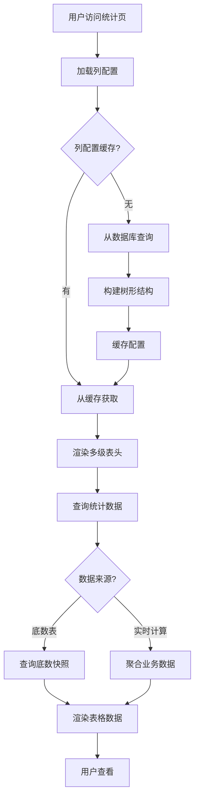
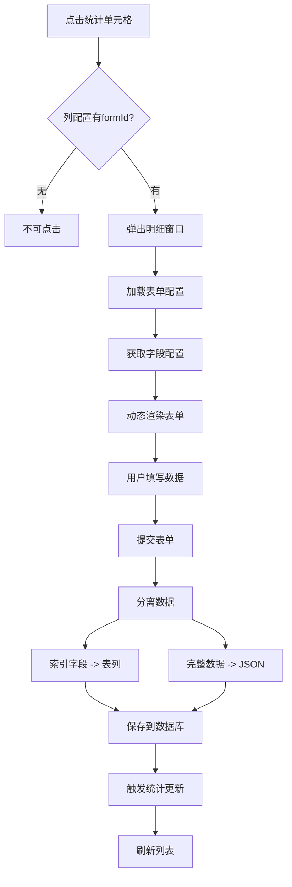
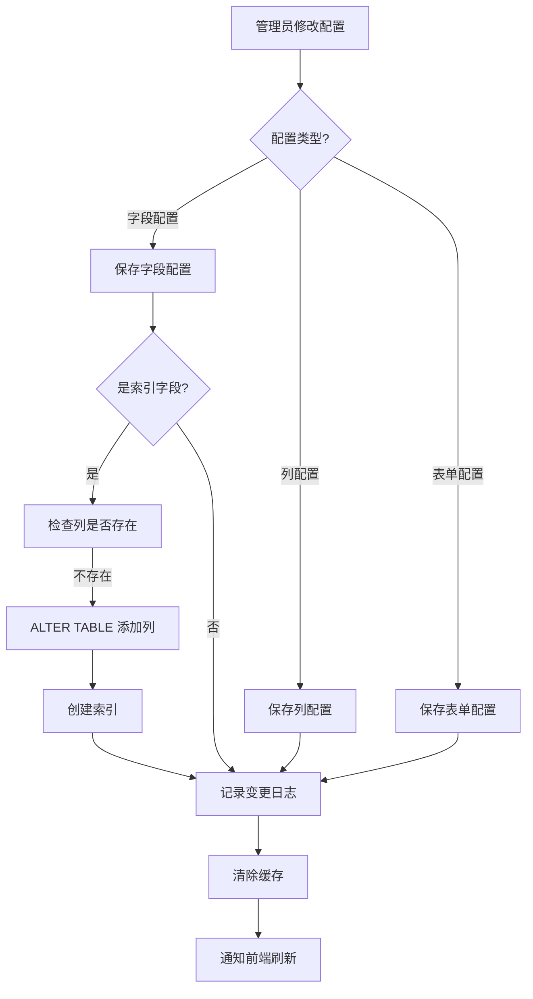
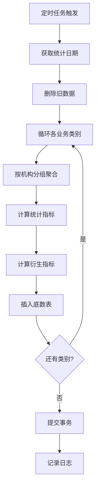

# 数据晾晒统计系统 - 系统架构设计文档

## 📐 系统架构总览

### 1.1 整体架构图

```
┌─────────────────────────────────────────────────────────────────┐
│                         前端层 (Vue2)                            │
├─────────────────────────────────────────────────────────────────┤
│  ┌─────────────┐  ┌─────────────┐  ┌─────────────┐            │
│  │ 数据统计页  │  │ 列配置管理  │  │ 表单配置    │            │
│  └─────────────┘  └─────────────┘  └─────────────┘            │
│                                                                  │
│  ┌──────────────────────────────────────────────────┐          │
│  │          通用组件(HDty框架已有)                   │          │
│  │  - hd-form: 动态表单基础组件                     │          │
│  │  - hd-build-table: 多级表头表格                 │          │
│  │  - hd-dict-*: 字典选择类组件                    │          │
│  │  - hd-date-picker: 日期选择器                   │          │
│  │  - hd-image-upload: 图片上传                    │          │
│  │  - hd-qrcode: 二维码生成                        │          │
│  │  - hd-video-play: 视频播放                      │          │
│  └──────────────────────────────────────────────────┘          │
└─────────────────────────────────────────────────────────────────┘
                              ↕ HTTP/AJAX
┌─────────────────────────────────────────────────────────────────┐
│                      后端层 (Spring Boot)                        │
├─────────────────────────────────────────────────────────────────┤
│  ┌───────────────────────────────────────────────────┐         │
│  │             Controller层 (RESTful API)            │         │
│  │  - ColumnController  - FormController             │         │
│  │  - DataController    - StatController             │         │
│  └───────────────────────────────────────────────────┘         │
│                              ↕                                  │
│  ┌───────────────────────────────────────────────────┐         │
│  │                  Service层                        │         │
│  │  - ColumnService  - FormService                   │         │
│  │  - DataService    - StatService                   │         │
│  │  核心能力:                                         │         │
│  │    • 动态SQL构建                                   │         │
│  │    • 字段映射转换                                  │         │
│  │    • 统计数据计算                                  │         │
│  └───────────────────────────────────────────────────┘         │
│                              ↕                                  │
│  ┌───────────────────────────────────────────────────┐         │
│  │                 Mapper层 (MyBatis)                │         │
│  │  - ColumnMapper  - FormMapper                     │         │
│  │  - DataMapper    - StatMapper                     │         │
│  └───────────────────────────────────────────────────┘         │
└─────────────────────────────────────────────────────────────────┘
                              ↕ JDBC
┌─────────────────────────────────────────────────────────────────┐
│                       数据层 (Oracle)                            │
├─────────────────────────────────────────────────────────────────┤
│  ┌──────────────┐  ┌──────────────┐  ┌──────────────┐         │
│  │ 配置表        │  │ 业务数据表    │  │ 统计表        │         │
│  │ - 列配置      │  │ - 通用数据表  │  │ - 底数表      │         │
│  │ - 表单配置    │  │   (JSON+映射) │  │ - 日志表      │         │
│  │ - 字段配置    │  │              │  │              │         │
│  └──────────────┘  └──────────────┘  └──────────────┘         │
│                                                                  │
│  ┌──────────────────────────────────────────────────┐          │
│  │             存储过程                              │          │
│  │  - SP_ADD_DATA_COLUMN (动态添加列)               │          │
│  │  - SP_CALC_DAILY_STAT (统计计算)                 │          │
│  └──────────────────────────────────────────────────┘          │
└─────────────────────────────────────────────────────────────────┘
```

---

## 🔄 核心业务流程

### 2.1 数据统计展示流程



### 2.2 明细数据录入流程



### 2.3 配置变更流程



### 2.4 统计数据生成流程



---

## 🗂️ 数据流转设计

### 3.1 配置数据流转

```
┌──────────────┐
│ 管理员配置   │
└──────┬───────┘
       │
       ▼
┌──────────────────────────────┐
│ SYS_COLUMN_CONFIG            │  列配置表
│ - 树形结构                    │  
│ - 列属性                      │
│ - 关联表单                    │
└──────┬───────────────────────┘
       │
       ▼
┌──────────────────────────────┐
│ 前端缓存 (Vuex)              │
│ - columns: []                │
└──────┬───────────────────────┘
       │
       ▼
┌──────────────────────────────┐
│ MultiLevelTable组件(使用hd-build-table封装)      │
│ - 递归渲染el-table-column    │
└──────────────────────────────┘
```

### 3.2 业务数据流转

```
┌──────────────┐
│ 用户录入     │
└──────┬───────┘
       │
       ▼
┌──────────────────────────────┐
│ DynamicForm组件(使用hd-form封装)                │
│ formData = {                 │
│   checkTime: '2025-11-25',   │
│   checker: '张三',           │
│   remark: '...'              │
│ }                            │
└──────┬───────────────────────┘
       │
       ▼
┌──────────────────────────────┐
│ 后端DataService              │
│ 1. 获取字段配置               │
│ 2. 分离索引/非索引字段        │
└──────┬───────────────────────┘
       │
       ├─────────┬──────────────┐
       │         │              │
       ▼         ▼              ▼
   ┌───────┐ ┌────────┐  ┌──────────┐
   │ JSON  │ │ 映射列  │  │ 系统字段 │
   └───┬───┘ └───┬────┘  └────┬─────┘
       │         │            │
       └─────────┼────────────┘
                 ▼
   ┌─────────────────────────────┐
   │ BIZ_DATA_COMMON             │
   │ - DATA_JSON: CLOB           │
   │ - CHECK_TIME: DATE          │ (映射列)
   │ - CHECKER: VARCHAR2         │ (映射列)
   │ - ORG_ID, FORM_ID...        │
   └─────────────────────────────┘
```

### 3.3 统计数据流转

```
┌──────────────────────────────┐
│ BIZ_DATA_COMMON (明细数据)   │
└──────┬───────────────────────┘
       │
       ▼ (定时任务/手动触发)
┌──────────────────────────────┐
│ SP_CALC_DAILY_STAT           │ 存储过程
│ - 按机构分组                  │
│ - 聚合统计                    │
│ - 计算衍生指标                │
└──────┬───────────────────────┘
       │
       ▼
┌──────────────────────────────┐
│ STAT_DAILY_BASE              │
│ - ORG_ID                     │
│ - STAT_DATE                  │
│ - POPULATION_TOTAL           │
│ - POPULATION_INSPECT_TOTAL   │
│ - ...                        │
└──────┬───────────────────────┘
       │
       ▼
┌──────────────────────────────┐
│ 前端数据统计列表              │
│ - 多级表头展示                │
│ - 可点击进入明细              │
└──────────────────────────────┘
```

---

## 🔑 关键技术方案

### 4.1 动态表单方案

#### 4.1.1 配置驱动渲染

**核心思想**: 通过JSON配置驱动表单渲染,而非硬编码

**配置示例**:
```json
{
  "formId": "FORM001",
  "formName": "抽查记录",
  "fields": [
    {
      "fieldName": "checkTime",
      "fieldLabel": "抽查时间",
      "fieldType": "date",
      "isRequired": true,
      "showInForm": true,
      "showInList": true,
      "showInQuery": true,
      "dbColumn": "CHECK_TIME",
      "isIndexField": true
    },
    {
      "fieldName": "remark",
      "fieldLabel": "备注",
      "fieldType": "textarea",
      "isRequired": false,
      "showInForm": true,
      "showInList": false,
      "isIndexField": false
    }
  ]
}
```

**渲染逻辑**:
```javascript
// 根据fieldType动态选择组件
const componentMap = {
  'input': InputField,
  'select': SelectField,
  'date': DateField,
  'textarea': TextareaField
}

<component :is="componentMap[field.fieldType]" />
```

#### 4.1.2 字段映射机制

**问题**: 如何平衡灵活性和查询性能?

**解决方案**: JSON存储 + 字段映射

| 字段类型   | 存储方式    | 查询方式         |
| ---------- | ----------- | ---------------- |
| 非重要字段 | 仅存JSON    | JSON函数查询(慢) |
| 索引字段   | JSON + 表列 | 直接查询列(快)   |

**映射流程**:
```
前端字段名 → 字段配置表 → 数据库列名
checkTime  → DB_COLUMN   → CHECK_TIME
```

**代码实现**:
```java
// 保存时
for (Field field : indexFields) {
    String dbColumn = field.getDbColumn();
    Object value = formData.get(field.getFieldName());
    FieldMapUtil.setFieldValue(entity, dbColumn, value);
}

// 查询时
for (Field field : indexFields) {
    Object value = FieldMapUtil.getFieldValue(entity, field.getDbColumn());
    result.put(field.getFieldName(), value);
}
```

---

### 4.2 多级表头方案

#### 4.2.1 树形结构设计

**数据结构**:
```json
[
  {
    "id": "001",
    "label": "实有人口",
    "children": [
      {
        "id": "001001",
        "label": "总数",
        "prop": "population_total"
      },
      {
        "id": "001002",
        "label": "抽查信息",
        "children": [
          {
            "id": "001002001",
            "label": "抽查总数",
            "prop": "check_total",
            "formId": "FORM001"
          },
          {
            "id": "001002002",
            "label": "不合格数",
            "prop": "check_fail"
          }
        ]
      }
    ]
  }
]
```

#### 4.2.2 递归渲染组件

```vue
<el-table-column :label="column.label">
  <!-- 如果有子列,递归渲染 -->
  <column-render
    v-for="child in column.children"
    :key="child.id"
    :column="child"
  />
  
  <!-- 叶子节点,渲染数据 -->
  <template v-else slot-scope="scope">
    <span @click="handleClick">
      {{ scope.row[column.prop] }}
    </span>
  </template>
</el-table-column>
```

#### 4.2.3 展开/收起控制

**方案**: 维护展开状态数组

```javascript
data() {
  return {
    expandedColumns: ['001', '002'] // 展开的列ID
  }
},
computed: {
  visibleColumns() {
    return this.filterColumns(this.columns)
  }
},
methods: {
  filterColumns(columns) {
    return columns.map(col => {
      if (col.children) {
        const isExpanded = this.expandedColumns.includes(col.id)
        if (isExpanded || col.defaultExpand) {
          return { ...col, children: this.filterColumns(col.children) }
        } else {
          return { ...col, children: [] }
        }
      }
      return col
    })
  }
}
```

---

### 4.3 动态SQL构建方案

#### 4.3.1 问题分析

**挑战**: 查询条件不固定,字段动态变化

**需求**:
- 支持任意字段查询
- 支持动态添加字段后的查询
- 性能可接受

#### 4.3.2 解决方案

**方案1**: MyBatis动态SQL (推荐)

```xml
<select id="selectByDynamicCondition" resultType="BizDataCommon">
  SELECT * FROM BIZ_DATA_COMMON
  WHERE FORM_ID = #{formId}
  AND STATUS = '1'
  
  <!-- 动态索引字段条件 -->
  <if test="indexConditions != null">
    <foreach collection="indexConditions" index="key" item="value">
      <if test="value != null">
        AND ${key} = #{value}
      </if>
    </foreach>
  </if>
</select>
```

**方案2**: 字符串拼接 (不推荐,注意SQL注入)

```java
StringBuilder sql = new StringBuilder("SELECT * FROM BIZ_DATA_COMMON WHERE 1=1");
for (Map.Entry<String, Object> entry : conditions.entrySet()) {
    sql.append(" AND ").append(entry.getKey()).append(" = ?");
}
```

**方案3**: QueryWrapper (MyBatis-Plus)

```java
QueryWrapper<BizDataCommon> wrapper = new QueryWrapper<>();
wrapper.eq("FORM_ID", formId);
indexConditions.forEach((key, value) -> {
    wrapper.eq(key, value);
});
```

---

### 4.4 统计数据计算方案

#### 4.4.1 计算策略

| 策略     | 优点     | 缺点     | 适用场景 |
| -------- | -------- | -------- | -------- |
| 实时计算 | 数据最新 | 性能差   | 数据量小 |
| 定时快照 | 性能好   | 有延迟   | 数据量大 |
| 增量更新 | 平衡     | 实现复杂 | 混合场景 |

**推荐方案**: 定时快照 + 手动刷新

#### 4.4.2 计算流程

```sql
-- 1. 删除旧数据
DELETE FROM STAT_DAILY_BASE WHERE STAT_DATE = :statDate;

-- 2. 计算统计数据
INSERT INTO STAT_DAILY_BASE (...)
SELECT 
    SYS_GUID() AS ID,
    ORG_ID,
    :statDate AS STAT_DATE,
    'POPULATION' AS CATEGORY,
    COUNT(*) AS POPULATION_TOTAL,
    SUM(CASE WHEN CHECK_TIME IS NOT NULL THEN 1 ELSE 0 END) AS CHECK_TOTAL
FROM BIZ_DATA_COMMON
WHERE FORM_ID = 'FORM001'
GROUP BY ORG_ID;

-- 3. 更新衍生指标
UPDATE STAT_DAILY_BASE
SET CHECK_RATE = ROUND(CHECK_TOTAL / POPULATION_TOTAL * 100, 2)
WHERE STAT_DATE = :statDate;
```

---

## 🎯 性能优化方案

### 5.1 前端优化

#### 5.1.1 Vuex状态缓存

利用HDty框架提供的Vuex模块管理列配置缓存,避免频繁API请求:

```javascript
// store/modules/column.js - 使用HDty框架的状态管理范式
export default {
  state: {
    columns: null,
    lastUpdateTime: null
  },
  mutations: {
    SET_COLUMNS(state, columns) {
      state.columns = columns
      state.lastUpdateTime = Date.now()
    }
  },
  actions: {
    // 缓存5分钟
    loadColumns({ state, commit }) {
      const now = Date.now()
      if (state.columns && now - state.lastUpdateTime < 5 * 60 * 1000) {
        return Promise.resolve(state.columns)
      }
      // 调用API加载
      return api.getColumnTree().then(data => {
        commit('SET_COLUMNS', data)
        return data
      })
    }
  }
}
```

#### 5.1.2 Element-UI表格优化

针对大数据量场景,Element-UI 2.12.0支持通过以下方式优化:

```vue
<!-- 1. 固定列优化 -->
<el-table-column fixed="left" prop="orgName" label="机构名" />

<!-- 2. 按需加载(分页) -->
<el-pagination
  :current-page="pageNum"
  :page-size="pageSize"
  :total="total"
  @current-change="handlePageChange"
/>

<!-- 3. 行样式处理 -->
<el-table
  :row-class-name="row => row.rowIndex % 2 === 0 ? 'even-row' : 'odd-row'"
/>
```

#### 5.1.3 Axios+Vuex缓存策略

利用HDty框架提供的axios-init初始化,配合响应拦截器实现数据缓存:

```javascript
// 在api/column.js中
import { store } from '@/store'

export function getColumnConfig() {
  // 先检查缓存
  const cached = store.state.column.data
  if (cached && Date.now() - cached.cacheTime < 5 * 60 * 1000) {
    return Promise.resolve({ data: cached })
  }
  
  return axios.get('/api/column/config').then(res => {
    // 更新缓存
    store.commit('column/SET_DATA', res.data)
    return res
  })
}
```

---

### 5.2 后端优化

#### 5.2.1 SQL优化

**索引优化**:
```sql
-- 复合索引
CREATE INDEX IDX_DATA_FORM_ORG ON BIZ_DATA_COMMON(FORM_ID, ORG_ID);

-- 函数索引(JSON查询)
CREATE INDEX IDX_DATA_JSON ON BIZ_DATA_COMMON(
    JSON_VALUE(DATA_JSON, '$.checkTime')
);
```

**查询优化**:
```sql
-- 避免SELECT *
SELECT ID, ORG_ID, DATA_JSON, CHECK_TIME, CHECKER
FROM BIZ_DATA_COMMON
WHERE ...

-- 使用ROWNUM分页
SELECT * FROM (
    SELECT A.*, ROWNUM RN FROM (
        SELECT * FROM BIZ_DATA_COMMON ORDER BY CREATE_TIME DESC
    ) A WHERE ROWNUM <= :endRow
) WHERE RN > :startRow
```

#### 5.2.2 缓存策略

**配置缓存**:
```java
@Cacheable(value = "columnConfig", key = "#root.methodName")
public List<ColumnTreeVO> getColumnTree() {
    // ...
}

@CacheEvict(value = "columnConfig", allEntries = true)
public void saveColumn(SysColumnConfig config) {
    // ...
}
```

**统计数据缓存**:
```java
@Cacheable(value = "statData", key = "#orgId + '_' + #statDate")
public List<StatDataVO> getStatData(String orgId, Date statDate) {
    // ...
}
```

#### 5.2.3 连接池优化

```yaml
spring:
  datasource:
    druid:
      initial-size: 10
      min-idle: 10
      max-active: 50
      max-wait: 60000
      test-while-idle: true
      time-between-eviction-runs-millis: 60000
```

---

### 5.3 数据库优化

#### 5.3.1 表分区

```sql
-- 按月分区
CREATE TABLE STAT_DAILY_BASE (
    ...
)
PARTITION BY RANGE (STAT_DATE) (
    PARTITION P202511 VALUES LESS THAN (TO_DATE('2025-12-01', 'YYYY-MM-DD')),
    PARTITION P202512 VALUES LESS THAN (TO_DATE('2026-01-01', 'YYYY-MM-DD'))
);
```

#### 5.3.2 定期维护

```sql
-- 收集统计信息
EXEC DBMS_STATS.GATHER_TABLE_STATS('SCHEMA_NAME', 'BIZ_DATA_COMMON');

-- 重建索引
ALTER INDEX IDX_DATA_FORM_ORG REBUILD;

-- 清理碎片
ALTER TABLE BIZ_DATA_COMMON MOVE;
```

---

## 🔐 安全设计

### 6.1 权限控制

#### 6.1.1 数据权限

```java
// 基于机构的数据隔离
@Service
public class DataServiceImpl implements IDataService {
    
    @Resource
    private UserContext userContext;
    
    public List<Map<String, Object>> queryDataList(DataQueryDTO dto) {
        // 获取当前用户所属机构
        String userOrgId = userContext.getCurrentUser().getOrgId();
        
        // 限制只能查询本机构数据
        dto.setOrgId(userOrgId);
        
        return dataMapper.selectByDynamicCondition(dto);
    }
}
```

#### 6.1.2 操作权限

```java
// 基于角色的权限控制
@PreAuthorize("hasRole('ADMIN')")
@PostMapping("/column/save")
public Result<Void> saveColumn(@RequestBody SysColumnConfig config) {
    // ...
}
```

---

### 6.2 SQL注入防护

**原则**: 所有动态SQL使用参数化查询

```java
// ❌ 错误示例
String sql = "SELECT * FROM TABLE WHERE COLUMN = '" + userInput + "'";

// ✅ 正确示例
String sql = "SELECT * FROM TABLE WHERE COLUMN = ?";
jdbcTemplate.query(sql, new Object[]{userInput}, ...);
```

---

### 6.3 敏感数据保护

```java
// 数据脱敏
public class SensitiveDataUtil {
    public static String maskPhone(String phone) {
        if (phone == null || phone.length() < 11) {
            return phone;
        }
        return phone.substring(0, 3) + "****" + phone.substring(7);
    }
}
```

---

## 📊 监控与日志

### 7.1 日志设计

```java
@Slf4j
@Service
public class DataServiceImpl implements IDataService {
    
    public void saveData(Map<String, Object> dataMap) {
        log.info("开始保存数据, formId={}, orgId={}", 
            dataMap.get("formId"), dataMap.get("orgId"));
        
        try {
            // 业务逻辑
            log.info("数据保存成功, id={}", entity.getId());
        } catch (Exception e) {
            log.error("数据保存失败", e);
            throw e;
        }
    }
}
```

### 7.2 操作日志

```java
// 记录配置变更
@Service
public class ConfigLogService {
    
    public void logConfigChange(String configType, String configId, 
                                String oldValue, String newValue) {
        SysConfigLog log = new SysConfigLog();
        log.setConfigType(configType);
        log.setConfigId(configId);
        log.setOldValue(oldValue);
        log.setNewValue(newValue);
        log.setOperateTime(new Date());
        configLogMapper.insert(log);
    }
}
```

---

## 🚀 部署方案

### 8.1 前端部署

```bash
# 构建
npm run build

# 部署到Nginx
cp -r dist/* /usr/share/nginx/html/
```

**Nginx配置**:
```nginx
server {
    listen 80;
    server_name your-domain.com;
    
    location / {
        root /usr/share/nginx/html;
        index index.html;
        try_files $uri $uri/ /index.html;
    }
    
    location /api/ {
        proxy_pass http://localhost:8080/;
    }
}
```

---

### 8.2 后端部署

```bash
# 打包
mvn clean package

# 运行
java -jar hdty-data-overview.jar \
  --spring.profiles.active=prod \
  --server.port=8080
```

---

## 📝 附录

### 附录A: 技术选型对比

| 技术点     | 建议方案            | 说明                          |
| ---------- | ------------------- | ----------------------------- |
| 前端框架   | Vue 2.6.14          | 与HDty框架一致,不考虑升级Vue3 |
| UI库       | Element-UI 2.12.0   | 与HDty框架绑定,无需更改       |
| 构建工具   | Webpack 4.46.0      | 通过Vue CLI 4进行配置         |
| HTTP客户端 | Axios 0.18.0        | 已由HDty框架axios-init封装    |
| 表单方案   | hd-form + 动态配置  | 使用HDty框架组件,不自建       |
| 数据存储   | JSON+映射           | 灵活性和性能兼顾              |
| 统计计算   | 定时快照 + 实时刷新 | 性能最优方案                  |
| 地图组件   | hd-map-baidu        | 与HDty框架集成                |
| 字典管理   | hd-dict-*           | 利用HDty框架内置支持          |

### 附录B: HDty框架集成指南

1. **自定义组件使用原则**:
   - 优先使用HDty框架的hd-*系列组件
   - 避免重复自建同类功能的组件
   - 若需扩展,在HDty组件基础上进行二次开发

2. **路由和权限管理**:
   - 使用HDty框架的路由守卫机制
   - 集成现有的权限管理系统
   - 支持按机构、按角色的数据隔离

3. **存储和缓存**:
   - 使用HDty框架的storage工具
   - 支持localstorage和sessionStorage
   - 配合Vuex进行状态管理

4. **数据字典**:
   - 利用hd-dict-*组件进行字典选择
   - 支持远程字典和静态字典
   - 自动翻译和级联支持

---

**文档版本**: 1.1  
**最后更新**: 2025-11-25  
**对应业务版本**: 2.0.1  
**适配HDty框架**: 2.1.0
