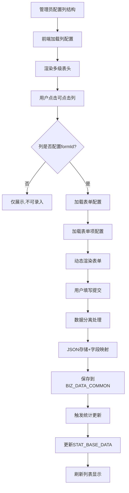

# 数据晾晒统计系统 - 系统设计讲解说明文档

## 📘 文档说明

本文档从零开始讲解数据晾晒统计系统的完整设计思路,包括简单的业务理解、数据库设计原理、核心业务逻辑关联,以及系统的扩展维度设计。适合开发人员快速理解系统架构,也可作为新人培训材料。

---

## 🎯 一、业务背景与目标

### 1.1 什么是"数据晾晒"?

**数据晾晒**是政府部门常用的一种数据公开展示方式,将各基层机构的业务数据进行统计汇总,以表格形式公开展示,便于对比分析和考核监督。

**典型场景**:
```
某区政府需要展示各街道的基层治理数据:
- 实有人口管理情况(总数、流动人口、核查率等)
- 实有单位管理情况(总数、新增数、核查率等)  
- 特定对象管控情况(重点人员、管控率等)
- 矛盾纠纷调处情况(总数、调解数、成功率等)
```

### 1.2 系统核心目标

1. **灵活配置**: 业务类别可配置,表头结构可调整,无需修改代码
2. **数据录入**: 点击统计数据可进入明细录入,支持动态表单
3. **统计计算**: 自动聚合明细数据生成统计结果
4. **历史追溯**: 记录每日统计底数,支持趋势分析

---

## 🧩 二、核心设计思想

### 2.1 设计原则

#### 原则1: 配置驱动,而非硬编码

**传统方式(硬编码)**:
```java
// ❌ 硬编码 - 新增业务需要改代码
@GetMapping("/population")
public List<PopulationVO> getPopulation() {
    return populationService.list();
}

@GetMapping("/unit")
public List<UnitVO> getUnit() {
    return unitService.list();
}
```

**配置驱动方式**:
```java
// ✅ 配置驱动 - 新增业务只需配置
@GetMapping("/stat/data")
public List<Map<String, Object>> getStatData() {
    // 从列配置表读取要展示哪些列
    List<ColumnConfig> columns = columnService.getAll();
    // 根据列配置动态查询数据
    return statService.getData(columns);
}
```

#### 原则2: JSON存储 + 字段映射

**为什么需要这种设计?**

```
问题: 不同业务的表单字段完全不同
- 抽查记录表单: 抽查时间、抽查人员、抽查对象...
- 矛盾纠纷表单: 纠纷类型、当事人、调解员...

挑战:
1. 如果每个表单建一张表 → 表太多,难管理
2. 如果所有数据存一张表 → 字段不够用,扩展困难
```

**解决方案: JSON + 映射**

```
BIZ_DATA_COMMON (通用数据表)
├── DATA_JSON (CLOB)          - 存储完整数据(所有字段)
├── FIELD_1~20 (VARCHAR2)      - 预留字符串字段(可映射)
├── DATE_1~5 (DATE)            - 预留日期字段(可映射)
├── NUM_1~5 (NUMBER)           - 预留数字字段(可映射)
└── DICT_1~10 (VARCHAR2)       - 预留字典字段(可映射)

优势:
1. 所有数据完整保存在JSON → 不丢数据
2. 重要字段映射到表列 → 查询快、可建索引
3. 新增字段无需改表结构 → 灵活扩展
```

**示例数据**:
```sql
INSERT INTO BIZ_DATA_COMMON (
    ID, FORM_ID, DATA_JSON, 
    DATE_1, FIELD_1, DICT_1  -- 映射字段
) VALUES (
    'DATA001', 'FORM_CHECK',
    '{"checkTime":"2025-11-25","checker":"张三","target":"李四","result":"合格","remark":"无异常"}',
    TO_DATE('2025-11-25','YYYY-MM-DD'),  -- 映射到DATE_1
    '张三',                               -- 映射到FIELD_1  
    '合格'                                -- 映射到DICT_1
);

-- 查询优势:
-- 快速查询(用映射字段)
SELECT * FROM BIZ_DATA_COMMON WHERE DATE_1 >= TO_DATE('2025-11-01','YYYY-MM-DD');

-- 完整数据(解析JSON)
SELECT DATA_JSON FROM BIZ_DATA_COMMON WHERE ID = 'DATA001';
```

### 2.2 三层配置架构

```
┌─────────────────────────────────────────┐
│   第一层: 列配置 (显示什么)             │
│   SYS_COLUMN_CONFIG                     │
│   - 管辖机构 (固定列)                   │
│   - 实有人口 (父列)                     │
│     └─ 总数 (子列,prop:population_total)│
│     └─ 抽查总数 (子列,可点击,formId=xxx) │
└─────────────────────────────────────────┘
           ↓ (点击"抽查总数")
┌─────────────────────────────────────────┐
│   第二层: 表单配置 (用什么表单录入)     │
│   SYS_FORM_CONFIG                       │
│   - 表单名称: 抽查记录表单              │
│   - 数据表: BIZ_DATA_COMMON             │
│   - 表单配置JSON: {...}                 │
└─────────────────────────────────────────┘
           ↓
┌─────────────────────────────────────────┐
│   第三层: 表单项配置 (表单有什么字段)   │
│   SYS_FORM_ITEM_CONFIG                  │
│   - 字段1: 抽查时间(date类型,映射到DATE_1)│
│   - 字段2: 抽查人员(input类型,映射到FIELD_1)│
│   - 字段3: 备注(textarea,不映射,仅存JSON) │
└─────────────────────────────────────────┘
```

---

## 🗄️ 三、数据库设计详解

### 3.1 表设计逻辑

#### 3.1.1 配置表 vs 业务表

```
【配置表】 - 系统管理员配置,变动少
├── SYS_COLUMN_CONFIG       (列配置)
├── SYS_FORM_CONFIG         (表单配置)
└── SYS_FORM_ITEM_CONFIG    (表单项配置)

【业务表】 - 用户日常使用,数据量大
├── BIZ_DATA_COMMON         (业务数据-通用表)
└── STAT_BASE_DATA          (统计底数表)
```

#### 3.1.2 底数表重新设计

**原设计问题**:
```sql
-- ❌ 按机构日期维度,每种业务一行
STAT_DAILY_BASE (ORG_ID, STAT_DATE, CATEGORY)
├── POPULATION_TOTAL
├── POPULATION_CHECK_RATE
├── UNIT_TOTAL
└── ... (字段很多,不同类别字段不同)

问题:
1. 新增业务类别需要加列
2. 字段语义不清晰
3. 难以扩展复杂指标
```

**新设计**:
```sql
-- ✅ 按字段维度,更灵活
STAT_BASE_DATA (
    ID,
    FORM_ID,           -- 表单ID
    FORM_ITEM_ID,      -- 表单项ID(字段)
    STAT_DATE,         -- 统计日期
    ORG_ID,            -- 机构ID
    VALUE_TYPE,        -- 值类型:count(计数)/avg(平均)/rate(比率)/sum(求和)
    VALUE_1,           -- 数值1(主值)
    VALUE_2,           -- 数值2(辅助值,如分子)
    VALUE_3            -- 数值3(辅助值,如分母)
)

优势:
1. 按字段存储,更细粒度
2. VALUE_TYPE支持多种指标类型
3. 三个值字段可组合计算复杂指标
```

**示例数据**:
```sql
-- 实有人口总数 (计数类型)
INSERT INTO STAT_BASE_DATA VALUES (
    'STAT001', 'FORM_POPULATION', 'ITEM_TOTAL', 
    '20251125', 'ORG001', 
    'count', 500, NULL, NULL
);

-- 核查率 (比率类型,需要分子分母)
INSERT INTO STAT_BASE_DATA VALUES (
    'STAT002', 'FORM_POPULATION', 'ITEM_CHECK_RATE',
    '20251125', 'ORG001',
    'rate', 95.5, 477, 500  -- 95.5% = 477/500*100
);

-- 平均抽查耗时 (平均类型)
INSERT INTO STAT_BASE_DATA VALUES (
    'STAT003', 'FORM_CHECK', 'ITEM_AVG_TIME',
    '20251125', 'ORG001', 
    'avg', 2.5, NULL, NULL  -- 平均2.5小时
);
```

### 3.2 关键表详解

#### 3.2.1 列配置表 (SYS_COLUMN_CONFIG)

**核心字段说明**:

| 字段          | 说明                | 示例                          |
| ------------- | ------------------- | ----------------------------- |
| PARENT_ID     | 父列ID,支持树形结构 | NULL(根节点) / COL001(子节点) |
| PROP          | 属性名名(叶子节点)  | population_total              |
| FORM_ID       | 关联表单ID(可点击)  | FORM001                       |
| COLUMN_CONFIG | 前端渲染JSON(CLOB)  | 样式、格式化等                |
| STATUS        | 启用状态            | 1-启用 0-停用                 |

**启用/停用机制**:
```sql
-- 停用某列(不删除,可恢复)
UPDATE SYS_COLUMN_CONFIG 
SET STATUS = '0',
    STATUS_REMARK = '该指标暂不统计',
    DISABLE_USER_GMSFHM = '110101199001011234',
    DISABLE_USERNAME = '张三',
    DISABLE_TIME = '20251125120000'
WHERE ID = 'COL001';

-- 前端查询只显示启用的列
SELECT * FROM SYS_COLUMN_CONFIG WHERE STATUS = '1' AND ZXBS = '0';
```

#### 3.2.2 表单项配置表 (SYS_FORM_ITEM_CONFIG)

**字段分离设计**:
```sql
-- 独立字段(便于查询和理解)
SHOW_IN_FORM   -- 是否在表单显示
SHOW_IN_LIST   -- 是否在列表显示  
SHOW_IN_QUERY  -- 是否作为查询条件
IS_FIXED       -- 是否映射到固定字段
TABLE_KEY      -- 映射的数据库列名
KEY_TYPE       -- 列类型(field/dict/date等)

-- JSON配置(灵活扩展的配置)
ITEM_CONFIG    -- 组件属性、验证规则、布局等
```

**为什么这样设计?**
```
独立字段适合:
✅ 后端要用的字段(如查询条件、列表显示)
✅ 经常变化需要快速查询的字段
✅ 需要建索引的字段

JSON配置适合:
✅ 前端渲染需要的配置
✅ 扩展性配置(如样式、联动规则)
✅ 不需要后端查询的字段
```

---

## 🔄 四、业务流程详解

### 4.1 完整业务链路



### 4.2 数据录入流程

**步骤1: 用户点击"抽查总数"单元格**
```javascript
// 前端获取列配置的formId
handleCellClick({ column, row }) {
    if (column.formId) {
        this.openDetailDialog(column.formId, row.orgId);
    }
}
```

**步骤2: 加载表单配置**
```sql
-- 查询表单基础信息
SELECT * FROM SYS_FORM_CONFIG WHERE ID = 'FORM001';

-- 查询表单项(仅PC表单场景)
SELECT * FROM SYS_FORM_ITEM_CONFIG 
WHERE FORM_ID = 'FORM001' 
AND SHOW_IN_FORM = '1'
AND ZXBS = '0'
ORDER BY ITEM_ORDER;
```

**步骤3: 前端动态渲染**
```vue
<el-form-item
    v-for="item in formItems"
    :label="item.itemLabel"
>
    <component 
        :is="getComponent(item.itemType)"
        :config="parseConfig(item.itemConfig)"
    />
</el-form-item>
```

**步骤4: 数据提交与分离**
```java
// 前端提交的数据
{
    "formId": "FORM001",
    "orgId": "ORG001",
    "checkTime": "2025-11-25",     // 前端字段名
    "checker": "张三",
    "checkResult": "合格",
    "remark": "无异常"
}

// 后端处理
public void saveData(Map<String, Object> dataMap) {
    // 1. 获取表单项配置
    List<FormItemConfig> items = getFormItems(formId);
    
    // 2. 分离数据
    Map<String, Object> jsonData = new HashMap<>();  // 完整JSON
    Map<String, Object> mappingData = new HashMap<>();  // 映射字段
    
    for (FormItemConfig item : items) {
        String fieldName = dataMap.get(item.getItemProp());
        jsonData.put(item.getItemProp(), fieldName);
        
        if ("1".equals(item.getIsFixed())) {
            // 映射字段
            mappingData.put(item.getTableKey(), fieldName);
        }
    }
    
    // 3. 保存
    BizDataCommon entity = new BizDataCommon();
    entity.setDataJson(JSON.toJSONString(jsonData));
    // 通过反射设置映射字段
    FieldMapUtil.setFields(entity, mappingData);
    dataMapper.insert(entity);
}
```

### 4.3 统计计算流程

**方式1: 定时任务(推荐)**
```sql
-- 存储过程: 每日凌晨2点执行
CREATE OR REPLACE PROCEDURE SP_CALC_DAILY_STAT(
    P_STAT_DATE IN DATE
) AS
BEGIN
    -- 清空旧数据
    DELETE FROM STAT_BASE_DATA WHERE STAT_DATE = P_STAT_DATE;
    
    -- 计算各表单各字段的统计数据
    FOR form IN (SELECT DISTINCT FORM_ID FROM SYS_FORM_CONFIG WHERE ZXBS='0') LOOP
        FOR item IN (SELECT * FROM SYS_FORM_ITEM_CONFIG WHERE FORM_ID=form.FORM_ID) LOOP
            
            -- 根据字段类型计算
            IF item.VALUE_TYPE = 'count' THEN
                -- 计数
                INSERT INTO STAT_BASE_DATA (...)
                SELECT 
                    SYS_GUID(),
                    form.FORM_ID,
                    item.ID,
                    P_STAT_DATE,
                    ORG_ID,
                    'count',
                    COUNT(*),
                    NULL,
                    NULL
                FROM BIZ_DATA_COMMON
                WHERE FORM_ID = form.FORM_ID
                AND ZXBS = '0'
                GROUP BY ORG_ID;
                
            ELSIF item.VALUE_TYPE = 'avg' THEN
                -- 平均值
                INSERT INTO STAT_BASE_DATA (...)
                SELECT 
                    SYS_GUID(),
                    form.FORM_ID,
                    item.ID,
                    P_STAT_DATE,
                    ORG_ID,
                    'avg',
                    AVG(item.TABLE_KEY),  -- 映射字段求平均
                    NULL,
                    NULL
                FROM BIZ_DATA_COMMON
                WHERE FORM_ID = form.FORM_ID
                GROUP BY ORG_ID;
            END IF;
            
        END LOOP;
    END LOOP;
    
    COMMIT;
END;
/
```

**方式2: 实时触发**
```java
@Transactional
public void saveData(BizDataCommon data) {
    // 1. 保存业务数据
    dataMapper.insert(data);
    
    // 2. 增量更新统计
    updateStat(data.getFormId(), data.getOrgId());
}

private void updateStat(String formId, String orgId) {
    // 重新计算该机构该表单的统计数据
    statMapper.refreshByOrgAndForm(orgId, formId, new Date());
}
```

---

## 🔧 五、核心技术实现

### 5.1 动态SQL构建

**挑战**: 查询条件不固定,映射字段是动态的

**解决方案: MyBatis动态SQL**
```xml
<select id="selectByCondition" parameterType="map" resultType="BizDataCommon">
    SELECT * FROM BIZ_DATA_COMMON
    WHERE FORM_ID = #{formId}
    AND ZXBS = '0'
    <if test="orgId != null">
        AND ORG_ID = #{orgId}
    </if>
    
    <!-- 动态映射字段条件 -->
    <if test="conditions != null">
        <foreach collection="conditions" index="column" item="value">
            <if test="value != null">
                AND ${column} = #{value}
            </if>
        </foreach>
    </if>
    
    ORDER BY CREATE_TIME DESC
</select>
```

### 5.2 字段映射工具

```java
public class FieldMapUtil {
    /**
     * 设置字段值(通过反射)
     */
    public static void setFieldValue(Object entity, String fieldName, Object value) {
        try {
            // 将下划线转驼峰: CHECK_TIME -> checkTime
            String propertyName = toCamelCase(fieldName);
            
            Field field = entity.getClass().getDeclaredField(propertyName);
            field.setAccessible(true);
            
            // 类型转换
            Object convertedValue = convertValue(value, field.getType());
            field.set(entity, convertedValue);
        } catch (Exception e) {
            throw new RuntimeException("字段映射失败: " + fieldName, e);
        }
    }
    
    /**
     * 获取字段值
     */
    public static Object getFieldValue(Object entity, String fieldName) {
        try {
            String propertyName = toCamelCase(fieldName);
            Field field = entity.getClass().getDeclaredField(propertyName);
            field.setAccessible(true);
            return field.get(entity);
        } catch (Exception e) {
            return null;
        }
    }
    
    private static String toCamelCase(String str) {
        // CHECK_TIME -> checkTime
        StringBuilder result = new StringBuilder();
        boolean nextUpper = false;
        for (char c : str.toLowerCase().toCharArray()) {
            if (c == '_') {
                nextUpper = true;
            } else {
                result.append(nextUpper ? Character.toUpperCase(c) : c);
                nextUpper = false;
            }
        }
        return result.toString();
    }
}
```

---

## 🚀 六、系统扩展维度

### 6.1 扩展点设计

#### 6.1.1 新增业务类别

**场景**: 需要新增"校园安全"统计模块

**操作步骤**:
```
1. 配置列结构
   INSERT INTO SYS_COLUMN_CONFIG (LABEL, PROP, FORM_ID) 
   VALUES ('校园安全', 'campus_safety', 'FORM_CAMPUS');

2. 配置表单
   INSERT INTO SYS_FORM_CONFIG (FORM_CODE, FORM_NAME)
   VALUES ('CAMPUS_SAFETY', '校园安全检查表单');

3. 配置表单项
   INSERT INTO SYS_FORM_ITEM_CONFIG (ITEM_LABEL, ITEM_PROP, ...)
   VALUES ('检查时间', 'checkTime', ...);

4. 无需修改代码,前端自动渲染!
```

#### 6.1.2 新增表单字段

**场景**: "抽查记录"表单需要新增"整改期限"字段

**情况1: 需要查询(索引字段)**
```sql
-- 1. 配置字段
INSERT INTO SYS_FORM_ITEM_CONFIG (
    ITEM_LABEL, ITEM_PROP, IS_FIXED, TABLE_KEY, KEY_TYPE
) VALUES (
    '整改期限', 'rectifyDeadline', '1', 'DATE_2', 'date'
);

-- 2. 系统自动检查并添加列
-- (通过存储过程或应用层代码检查DATE_2是否存在)
ALTER TABLE BIZ_DATA_COMMON ADD DATE_2 DATE;
CREATE INDEX IDX_DATA_DATE2 ON BIZ_DATA_COMMON(DATE_2);
```

**情况2: 不需要查询(仅展示)**
```sql
-- 仅配置,不映射到表列
INSERT INTO SYS_FORM_ITEM_CONFIG (
    ITEM_LABEL, ITEM_PROP, IS_FIXED
) VALUES (
    '整改说明', 'rectifyRemark', '0'  -- 仅存JSON
);

-- 无需改表结构!
```

### 6.2 多维度统计扩展

#### 6.2.1 时间维度

**场景**: 需要按月度、季度、年度统计

**方案**: 底数表增加周期字段
```sql
ALTER TABLE STAT_BASE_DATA ADD STAT_PERIOD VARCHAR2(10);
-- 可选值: day/week/month/quarter/year

-- 查询月度统计
SELECT * FROM STAT_BASE_DATA 
WHERE STAT_PERIOD = 'month'
AND STAT_DATE LIKE '202511%';
```

#### 6.2.2 区域维度

**场景**: 需要按区域汇总(市、区、街道)

**方案**: 利用机构层级
```sql
-- 按区级汇总
SELECT 
    SUBSTR(ORG_ID, 1, 4) AS REGION_CODE,
    SUM(VALUE_1) AS TOTAL
FROM STAT_BASE_DATA
WHERE STAT_DATE = '20251125'
GROUP BY SUBSTR(ORG_ID, 1, 4);
```

#### 6.2.3 对比维度

**场景**: 同比、环比分析

**方案**: 查询多个日期的底数
```sql
-- 同比(与去年同期对比)
SELECT 
    t1.ORG_ID,
    t1.VALUE_1 AS CURRENT_VALUE,
    t2.VALUE_1 AS LAST_YEAR_VALUE,
    ROUND((t1.VALUE_1 - t2.VALUE_1) / t2.VALUE_1 * 100, 2) AS GROWTH_RATE
FROM STAT_BASE_DATA t1
LEFT JOIN STAT_BASE_DATA t2 
    ON t1.ORG_ID = t2.ORG_ID
    AND t1.FORM_ID = t2.FORM_ID
    AND t1.FORM_ITEM_ID = t2.FORM_ITEM_ID
WHERE t1.STAT_DATE = '20251125'
AND t2.STAT_DATE = '20241125';
```

## 📚 辅助技术

使用HDty框架已提供的常用技术:

1. **身份授权**: 使用HDty框架的权限管理
   - 支持按机构执行管理
   - 支持按角色控制
   - 部分功能权限控制

2. **数据传输**: 使用 axios-init 初始化 + Axios
   - 自动添加 token
   - 统一错误处理
   - 支持拦截器扩展

3. **数据字典**: 使用 hd-dict-* 组件
   - 远程字典
   - 静态字典
   - 级联联动

4. **本地存储**: 使用 storage 工具
   - localstorage
   - sessionStorage
   - 自动加稀

---

## 📊 七、完整业务示例

### 7.1 完整配置示例

假设要实现"社区矛盾纠纷"统计模块:

**第1步: 配置列结构**
```sql
-- 1. 父列
INSERT INTO SYS_COLUMN_CONFIG VALUES (
    'COL_DISPUTE', NULL, '矛盾纠纷', NULL, NULL, 'center', 
    NULL, 'false', 'true', NULL, NULL, NULL, 
    10, '1', NULL, ...
);

-- 2. 子列-总数
INSERT INTO SYS_COLUMN_CONFIG VALUES (
    'COL_DISPUTE_TOTAL', 'COL_DISPUTE', '总数', 'dispute_total', 
    100, 'center', NULL, 'true', 'true', 'FORM_DISPUTE', 
    'count', NULL, NULL, 11, '1', ...
);

-- 3. 子列-已调解数
INSERT INTO SYS_COLUMN_CONFIG VALUES (
    'COL_DISPUTE_MEDIATED', 'COL_DISPUTE', '已调解', 'dispute_mediated',
    100, 'center', NULL, 'true', 'true', 'FORM_DISPUTE',
    'count', NULL, NULL, 12, '1', ...
);

-- 4. 子列-成功率
INSERT INTO SYS_COLUMN_CONFIG VALUES (
    'COL_DISPUTE_RATE', 'COL_DISPUTE', '成功率', 'dispute_success_rate',
    100, 'center', NULL, 'true', 'true', NULL,
    'rate', NULL, NULL, 13, '1', ...
);
```

**第2步: 配置表单**
```sql
INSERT INTO SYS_FORM_CONFIG VALUES (
    'FORM_DISPUTE', 'DISPUTE_RECORD', '矛盾纠纷调解记录',
    'BIZ_DATA_COMMON', 'COMMON', '用于记录矛盾纠纷调解情况',
    '{"layout":"vertical","labelWidth":"120px"}',
    '0', NULL, NULL, NULL, NULL, NULL,
    '330102199001011234', '李四', '20251125120000', '330102',
    '330102199001011234', '李四', '20251125120000', '330102',
    NULL, 1
);
```

**第3步: 配置表单项**
```sql
-- 纠纷发生时间(映射到DATE_1)
INSERT INTO SYS_FORM_ITEM_CONFIG VALUES (
    'ITEM_DISPUTE_TIME', 'FORM_DISPUTE', 'date', '发生时间', 'occurTime', 1,
    '1', '1', '1', 120, '0', '0', '1',
    '1', 'DATE_1', 'date', 'DATE', NULL,
    '{"placeholder":"请选择发生时间","componentProps":{"type":"date","format":"yyyy-MM-dd"},"layout":{"span":12}}',
    '04', '0', ...
);

-- 纠纷类型(映射到DICT_1,字典翻译)
INSERT INTO SYS_FORM_ITEM_CONFIG VALUES (
    'ITEM_DISPUTE_TYPE', 'FORM_DISPUTE', 'select', '纠纷类型', 'disputeType', 2,
    '1', '1', '1', 100, '0', '0', '1',
    '1', 'DICT_1', 'dict', 'VARCHAR2', 'dispute_type',
    '{"options":{"dictType":"dispute_type"},"layout":{"span":12}}',
    '04', '0', ...
);

-- 调解结果(映射到DICT_2)
INSERT INTO SYS_FORM_ITEM_CONFIG VALUES (
    'ITEM_MEDIATE_RESULT', 'FORM_DISPUTE', 'select', '调解结果', 'mediateResult', 3,
    '1', '1', '0', 100, '0', '0', '1',
    '1', 'DICT_2', 'dict', 'VARCHAR2', 'mediate_result',
    '{"options":{"data":[{"label":"成功","value":"success"},{"label":"失败","value":"fail"}]},"layout":{"span":12}}',
    '04', '0', ...
);

-- 调解说明(不映射,仅存JSON)
INSERT INTO SYS_FORM_ITEM_CONFIG VALUES (
    'ITEM_MEDIATE_REMARK', 'FORM_DISPUTE', 'textarea', '调解说明', 'mediateRemark', 4,
    '1', '0', '0', NULL, '0', '0', '0',
    '0', NULL, NULL, NULL, NULL,
    '{"componentProps":{"rows":3,"maxlength":500},"layout":{"span":24}}',
    '04', '0', ...
);
```

**第4步: 数据录入示例**
```sql
-- 用户提交数据后,后端处理
INSERT INTO BIZ_DATA_COMMON (
    ID, FORM_ID, ORG_ID, DATA_JSON,
    DATE_1, DICT_1, DICT_2
) VALUES (
    'DATA_DISPUTE_001', 'FORM_DISPUTE', 'ORG001',
    '{"occurTime":"2025-11-25","disputeType":"邻里纠纷","mediateResult":"success","mediateRemark":"双方达成一致"}',
    TO_DATE('2025-11-25','YYYY-MM-DD'),  -- DATE_1
    '邻里纠纷',                           -- DICT_1
    'success'                             -- DICT_2
);
```

**第5步: 统计数据生成**
```sql
-- 每日统计任务生成底数
INSERT INTO STAT_BASE_DATA VALUES (
    'STAT_DISPUTE_001', 'FORM_DISPUTE', 'ITEM_DISPUTE_TIME',
    '20251125', 'ORG001',
    'count', 10, NULL, NULL  -- 总数10条
);

INSERT INTO STAT_BASE_DATA VALUES (
    'STAT_DISPUTE_002', 'FORM_DISPUTE', 'ITEM_MEDIATE_RESULT',
    '20251125', 'ORG001',
    'count', 8, NULL, NULL  -- 已调解8条(筛选mediateResult有值)
);

INSERT INTO STAT_BASE_DATA VALUES (
    'STAT_DISPUTE_003', 'FORM_DISPUTE', 'ITEM_MEDIATE_RESULT',
    '20251125', 'ORG001',
    'rate', 80, 8, 10  -- 成功率80% (8/10*100)
);
```

---

## 🎓 八、学习路径建议

### 8.1 新人上手顺序

**第1天: 理解业务**
- 阅读需求规格说明书
- 了解数据晾晒的业务场景
- 理解配置驱动的核心思想

**第2天: 掌握数据库**
- 理解表设计(配置表、业务表、底数表)
- 理解JSON+映射的设计原理
- 练习SQL查询

**第3天: 后端开发**
- 动态SQL构建
- 字段映射工具
- 统计计算逻辑

**第4天: 前端开发**
- 多级表头渲染
- 动态表单渲染
- JSON配置解析

**第5天: 联调测试**
- 完整业务流程测试
- 新增业务类别练习
- 性能优化

### 8.2 常见问题FAQ

**Q1: 为什么不每个表单建一张独立的表?**
```
A: 如果每个表单独立建表:
  - 表会非常多,难以管理
  - 新增业务需要建表,需要DBA权限
  - 统计逻辑分散,难以复用
  
  采用通用表+JSON:
  - 一张表解决所有表单
  - 新增业务无需改表
  - 统计逻辑统一
```

**Q2: JSON查询性能会不会很差?**
```
A: 重要字段映射到表列,性能无忧!
  - 查询条件用的字段 → 映射到表列(有索引)
  - 仅展示的字段 → 存JSON即可
  
  实测: 100万数据,映射字段查询<100ms
```

**Q3: 底数表为什么按字段维度设计?**
```
A: 更灵活!
  - 新增统计指标无需加列
  - 支持复杂指标(平均值、比率等)
  - 便于扩展多维度分析
```

---

## 📚 九、附录

### 9.1 技术术语表

| 术语     | 说明                                  |
| -------- | ------------------------------------- |
| 数据晾晒 | 将业务数据公开展示的形式              |
| 配置驱动 | 通过配置实现功能,而非硬编码           |
| 字段映射 | 前端字段名与数据库列名的对应关系      |
| 动态SQL  | 根据条件动态构建SQL语句               |
| 底数     | 统计的基础数据快照                    |
| CLOB     | Character Large Object,大文本字段类型 |

### 9.2 核心配置字段速查

**列配置(SYS_COLUMN_CONFIG)**
- `PARENT_ID`: 父列ID
- `PROP`: 数据属性名  
- `FORM_ID`: 关联表单ID(可点击)
- `STATUS`: 启用状态

**表单配置(SYS_FORM_CONFIG)**
- `FORM_CODE`: 表单编码
- `DATA_TABLE`: 数据存储表
- `FORM_CONFIG`: 表单配置JSON

**表单项配置(SYS_FORM_ITEM_CONFIG)**
- `ITEM_TYPE`: 组件类型
- `IS_FIXED`: 是否映射
- `TABLE_KEY`: 映射列名
- `ITEM_CONFIG`: 组件配置JSON

---

**文档版本**: 1.0  
**编写日期**: 2025-11-25  
**适用对象**: 开发人员、系统维护人员

