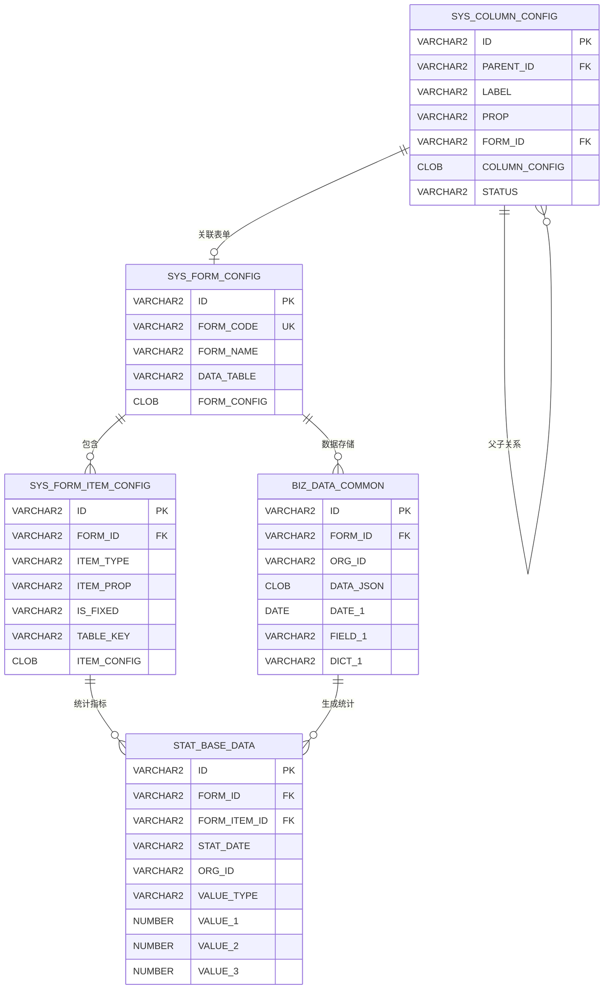
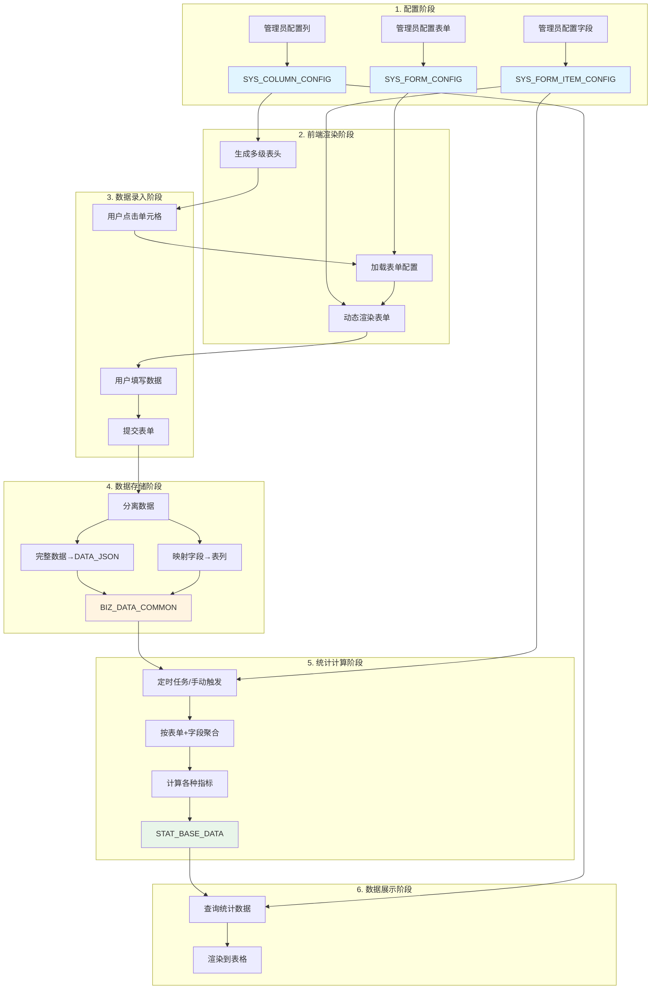
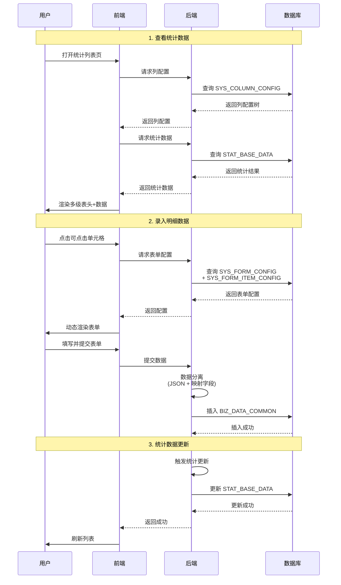
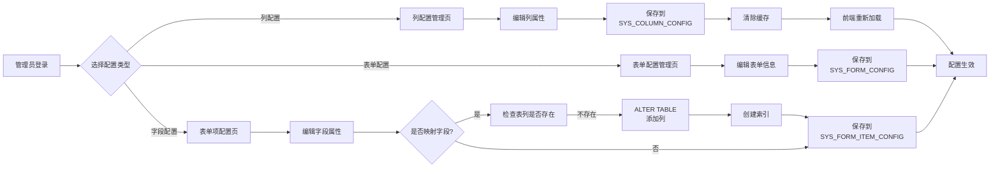

# 系统页面与数据库关系图

## 📱 一、系统页面结构

### 1.1 页面导航树

```
数据晾晒统计系统
├── 📊 数据统计模块
│   ├── 数据统计列表页 (主页面)
│   │   ├── 多级表头展示
│   │   ├── 统计数据展示
│   │   └── 单元格点击 → 明细数据弹窗
│   └── 明细数据管理弹窗
│       ├── 查询条件区
│       ├── 数据列表展示
│       └── 新增/编辑表单弹窗
│
├── ⚙️ 配置管理模块
│   ├── 列配置管理页
│   │   ├── 列树形结构展示
│   │   ├── 列属性编辑区
│   │   └── 启用/停用管理
│   ├── 表单配置管理页
│   │   ├── 表单列表
│   │   └── 表单基础信息编辑
│   └── 表单项配置管理页
│       ├── 表单项列表
│       ├── 字段属性编辑
│       └── 字段映射配置
│
└── 📈 统计分析模块
    ├── 趋势分析页
    ├── 同比环比分析页
    └── 数据导出页
```

---

## 🖥️ 二、核心页面详细设计

### 2.1 数据统计列表页 (主页面)

```
┌─────────────────────────────────────────────────────────────────┐
│  数据晾晒统计列表                   [日期选择] [导出] [配置管理]   │
├─────────────────────────────────────────────────────────────────┤
│                                                                   │
│  ┌──────────────────────────────────────────────────────────┐  │
│  │  查询条件区                                               │  │
│  │  机构: [全部 ▼]  日期: [2025-11-25]      [查询] [重置]   │  │
│  └──────────────────────────────────────────────────────────┘  │
│                                                                   │
│  ┌──────────────────────────────────────────────────────────┐  │
│  │  多级表头表格 (根据列配置动态生成)                        │  │
│  ├──────┬─────┬────────────────────────┬──────────────────┤  │
│  │机构  │总数 │  实有人口               │ 实有单位  │ ...  │  │
│  │      │     ├─────┬────┬─────┬─────┤           │      │  │
│  │      │     │总数 │流动│核查 │抽查  │   ...     │      │  │
│  │      │     │     │人口│率   │总数  │           │      │  │
│  ├──────┼─────┼─────┼────┼─────┼─────┼───────────┼──────┤  │
│  │XX街道│ 500 │ 200 │ 80 │95.5%│[50]▶│    100    │ ...  │  │
│  │YY街道│ 300 │ 150 │ 60 │92.0%│[30]▶│    80     │ ...  │  │
│  │ZZ街道│ 400 │ 180 │ 70 │97.0%│[40]▶│    90     │ ...  │  │
│  └──────┴─────┴─────┴────┴─────┴─────┴───────────┴──────┘  │
│                                                                   │
│  说明: [50]▶ 表示可点击查看明细                                  │
└─────────────────────────────────────────────────────────────────┘
```

**功能点**:
- ✅ 动态多级表头 (根据 `SYS_COLUMN_CONFIG` 生成)
- ✅ 可点击单元格 (配置了 `FORM_ID` 的列)
- ✅ 条件格式化 (通过 `COLUMN_CONFIG` JSON配置)
- ✅ 数据导出功能

---

### 2.2 明细数据管理弹窗

```
┌─────────────────────────────────────────────────────────────────┐
│  XX街道 - 抽查记录                            [关闭] [新增记录]   │
├─────────────────────────────────────────────────────────────────┤
│                                                                   │
│  ┌──────────────────────────────────────────────────────────┐  │
│  │  查询条件 (根据 SHOW_IN_QUERY='1' 的字段生成)            │  │
│  │  抽查时间: [2025-11-01] ~ [2025-11-30]                   │  │
│  │  抽查人员: [______]  抽查结果: [全部 ▼]  [查询] [重置]   │  │
│  └──────────────────────────────────────────────────────────┘  │
│                                                                   │
│  ┌──────────────────────────────────────────────────────────┐  │
│  │  数据列表 (根据 SHOW_IN_LIST='1' 的字段生成)             │  │
│  ├────┬──────────┬────────┬────────┬────────┬───────────┤  │
│  │序号│ 抽查时间  │抽查人员│抽查对象│抽查结果│  操作      │  │
│  ├────┼──────────┼────────┼────────┼────────┼───────────┤  │
│  │ 1  │2025-11-20│  张三  │  李四  │  合格  │[编辑][删除]│  │
│  │ 2  │2025-11-21│  王五  │  赵六  │不合格  │[编辑][删除]│  │
│  │ 3  │2025-11-22│  钱七  │  孙八  │  合格  │[编辑][删除]│  │
│  └────┴──────────┴────────┴────────┴────────┴───────────┘  │
│                                                                   │
│  分页: [1] 2 3 4 ... >  共 50 条                                │
└─────────────────────────────────────────────────────────────────┘
```

**功能点**:
- ✅ 动态查询条件 (根据 `SHOW_IN_QUERY` 配置)
- ✅ 动态列表列 (根据 `SHOW_IN_LIST` 配置)
- ✅ 新增/编辑/删除操作

---

### 2.3 动态表单弹窗 (新增/编辑)

```
┌─────────────────────────────────────────────────────────────────┐
│  新增抽查记录                                    [确定] [取消]    │
├─────────────────────────────────────────────────────────────────┤
│                                                                   │
│  表单内容 (根据 SYS_FORM_ITEM_CONFIG 动态生成)                   │
│                                                                   │
│  ┌──────────────────────────┬──────────────────────────────┐  │
│  │  抽查时间 *              │  抽查人员 *                  │  │
│  │  [2025-11-25      ▼]    │  [张三____________]          │  │
│  └──────────────────────────┴──────────────────────────────┘  │
│                                                                   │
│  ┌──────────────────────────┬──────────────────────────────┐  │
│  │  抽查对象 *              │  抽查结果 *                  │  │
│  │  [李四____________]      │  [合格            ▼]         │  │
│  └──────────────────────────┴──────────────────────────────┘  │
│                                                                   │
│  ┌──────────────────────────────────────────────────────────┐  │
│  │  所属机构 *                                               │  │
│  │  [XX街道                                          ▼]     │  │
│  └──────────────────────────────────────────────────────────┘  │
│                                                                   │
│  ┌──────────────────────────────────────────────────────────┐  │
│  │  备注                                                     │  │
│  │  ┌────────────────────────────────────────────────────┐ │  │
│  │  │ 无异常情况                                          │ │  │
│  │  │                                                      │ │  │
│  │  └────────────────────────────────────────────────────┘ │  │
│  │  0 / 500                                                 │  │
│  └──────────────────────────────────────────────────────────┘  │
│                                                                   │
│  说明: 带 * 的为必填项                                           │
└─────────────────────────────────────────────────────────────────┘
```

**功能点**:
- ✅ 根据 `ITEM_CONFIG` JSON 动态渲染组件
- ✅ 根据 `IS_REQUIRED` 控制必填
- ✅ 根据 `ITEM_TYPE` 选择组件类型
- ✅ 表单验证

---

### 2.4 列配置管理页

```
┌─────────────────────────────────────────────────────────────────┐
│  列配置管理                                [新增根节点] [保存]    │
├─────────────────────────────────────────────────────────────────┤
│                                                                   │
│  ┌────────────────────┬────────────────────────────────────┐   │
│  │  列树形结构         │  列详细配置                         │   │
│  │                    │                                    │   │
│  │  ├─ 管辖机构       │  ┌─────────────────────────────┐ │   │
│  │  ├─ 总数           │  │ 列ID: COL001002             │ │   │
│  │  ├─ 实有人口 ▼     │  │ 父节点: 实有人口             │ │   │
│  │  │  ├─ 总数        │  │ 列标题: 抽查总数             │ │   │
│  │  │  ├─ 流动人口数  │  │ 属性名: check_total        │ │   │
│  │  │  ├─ 核查率      │  │ 列宽: [100]px               │ │   │
│  │  │  ├─ 抽查总数 ←  │  │ 对齐: [居中 ▼]              │ │   │
│  │  │  └─ 不合格数    │  │ 关联表单: [抽查记录表单 ▼]   │ │   │
│  │  └─ 实有单位       │  │ 默认展开: ☑                 │ │   │
│  │                    │  │                             │ │   │
│  │  [拖拽调整顺序]    │  │ 启用状态: ● 启用  ○ 停用    │ │   │
│  │                    │  │ 备注: [________________]    │ │   │
│  │                    │  │                             │ │   │
│  │                    │  │ 列前端配置JSON:              │ │   │
│  │                    │  │ ┌───────────────────────┐ │ │   │
│  │                    │  │ │ {                      │ │ │   │
│  │                    │  │ │   "click": {           │ │ │   │
│  │                    │  │ │     "enabled": true    │ │ │   │
│  │                    │  │ │   }                    │ │ │   │
│  │                    │  │ │ }                      │ │ │   │
│  │                    │  │ └───────────────────────┘ │ │   │
│  │                    │  └─────────────────────────────┘ │   │
│  └────────────────────┴────────────────────────────────────┘   │
└─────────────────────────────────────────────────────────────────┘
```

**功能点**:
- ✅ 树形结构展示和编辑
- ✅ 拖拽调整顺序
- ✅ 启用/停用管理
- ✅ JSON配置编辑

---

### 2.5 表单项配置管理页

```
┌─────────────────────────────────────────────────────────────────┐
│  表单配置: 抽查记录表单                  [预览表单] [保存配置]    │
├─────────────────────────────────────────────────────────────────┤
│                                                                   │
│  ┌────────────────────┬────────────────────────────────────┐   │
│  │  表单项列表         │  字段详细配置                       │   │
│  │                    │                                    │   │
│  │  1. 抽查时间       │  ┌─────────────────────────────┐ │   │
│  │     [↑][↓][×]     │  │ 字段名: checkTime           │ │   │
│  │                    │  │ 标签: 抽查时间               │ │   │
│  │  2. 抽查人员 ←     │  │ 组件类型: [input ▼]         │ │   │
│  │     [↑][↓][×]     │  │ 占位符: 请输入抽查人员        │ │   │
│  │                    │  │                             │ │   │
│  │  3. 抽查对象       │  │ ☑ 必填                      │ │   │
│  │     [↑][↓][×]     │  │ ☑ 表单显示                  │ │   │
│  │                    │  │ ☑ 列表显示                  │ │   │
│  │  4. 抽查结果       │  │ ☑ 查询条件                  │ │   │
│  │     [↑][↓][×]     │  │                             │ │   │
│  │                    │  │ 数据映射:                    │ │   │
│  │  5. 备注           │  │ ☑ 映射到固定字段             │ │   │
│  │     [↑][↓][×]     │  │ 数据库列名: [FIELD_1 ▼]     │ │   │
│  │                    │  │ 列类型: [field ▼]           │ │   │
│  │  [+ 添加字段]      │  │ 数据类型: [VARCHAR2 ▼]      │ │   │
│  │                    │  │                             │ │   │
│  │                    │  │ 组件配置JSON:                │ │   │
│  │                    │  │ ┌───────────────────────┐ │ │   │
│  │                    │  │ │ {                      │ │ │   │
│  │                    │  │ │   "clearable": true,   │ │ │   │
│  │                    │  │ │   "maxlength": 50      │ │ │   │
│  │                    │  │ │ }                      │ │ │   │
│  │                    │  │ └───────────────────────┘ │ │   │
│  │                    │  └─────────────────────────────┘ │   │
│  └────────────────────┴────────────────────────────────────┘   │
└─────────────────────────────────────────────────────────────────┘
```

**功能点**:
- ✅ 字段列表展示和排序
- ✅ 字段映射配置
- ✅ 显示控制配置
- ✅ JSON配置编辑
- ✅ 表单预览

---

## 🗄️ 三、数据库表关系图

### 3.1 整体ER图



---

### 3.2 表分类与关系

```
┌─────────────────────────────────────────────────────────────┐
│                    配置层 (Configuration)                    │
├─────────────────────────────────────────────────────────────┤
│                                                              │
│  ┌──────────────────┐      ┌──────────────────┐           │
│  │ SYS_COLUMN_CONFIG│      │ SYS_FORM_CONFIG  │           │
│  │   (列配置表)      │──────│   (表单配置表)    │           │
│  │                  │ 关联 │                  │           │
│  │ - 树形结构       │      │ - 表单基础信息    │           │
│  │ - 列属性         │      │ - 表单级配置JSON  │           │
│  │ - 启用状态       │      │                  │           │
│  └──────────────────┘      └────────┬─────────┘           │
│         │                           │                      │
│         │                           │                      │
│         │                  ┌────────▼─────────┐           │
│         │                  │SYS_FORM_ITEM_    │           │
│         │                  │     CONFIG        │           │
│         │                  │(表单项配置表)     │           │
│         │                  │                  │           │
│         │                  │ - 字段属性       │           │
│         │                  │ - 数据映射       │           │
│         │                  │ - 显示控制       │           │
│         │                  │ - 组件配置JSON   │           │
│         │                  └──────────────────┘           │
│         │                           │                      │
└─────────┼───────────────────────────┼──────────────────────┘
          │                           │
          │                           │
┌─────────▼───────────────────────────▼──────────────────────┐
│                    业务层 (Business)                         │
├─────────────────────────────────────────────────────────────┤
│                                                              │
│                  ┌──────────────────┐                       │
│                  │ BIZ_DATA_COMMON  │                       │
│                  │  (业务数据表)     │                       │
│                  │                  │                       │
│                  │ - 完整JSON数据    │                       │
│                  │ - 预留映射字段    │                       │
│                  │   (DATE_1~5)     │                       │
│                  │   (FIELD_1~20)   │                       │
│                  │   (DICT_1~10)    │                       │
│                  │   (NUM_1~5)      │                       │
│                  └────────┬─────────┘                       │
│                           │                                  │
│                           │ 聚合统计                         │
│                           │                                  │
└───────────────────────────┼──────────────────────────────────┘
                            │
                            │
┌───────────────────────────▼──────────────────────────────────┐
│                   统计层 (Statistics)                         │
├─────────────────────────────────────────────────────────────┤
│                                                              │
│                  ┌──────────────────┐                       │
│                  │ STAT_BASE_DATA   │                       │
│                  │  (统计底数表)     │                       │
│                  │                  │                       │
│                  │ - 按字段维度存储  │                       │
│                  │ - 支持多种指标    │                       │
│                  │   (count/avg/    │                       │
│                  │    rate/sum)     │                       │
│                  │ - 多时间维度      │                       │
│                  │   (day/week/     │                       │
│                  │    month/year)   │                       │
│                  └──────────────────┘                       │
│                                                              │
└─────────────────────────────────────────────────────────────┘
```

---

### 3.3 数据流转关系图



---

### 3.4 表单数据存储机制图

```
用户填写表单数据:
┌─────────────────────────────────────────┐
│ checkTime: "2025-11-25"                │
│ checker: "张三"                         │
│ checkResult: "合格"                     │
│ remark: "无异常"                        │
└─────────────────────────────────────────┘
                   │
                   ▼
          根据 SYS_FORM_ITEM_CONFIG 分离
                   │
        ┌──────────┴──────────┐
        │                     │
        ▼                     ▼
  映射字段 (IS_FIXED=1)    非映射字段 (IS_FIXED=0)
  ┌─────────────────┐    ┌─────────────────┐
  │ checkTime       │    │ remark          │
  │ checker         │    │                 │
  │ checkResult     │    └─────────────────┘
  └─────────────────┘              │
        │                          │
        ▼                          │
  映射到表列                       │
  ┌─────────────────┐              │
  │ DATE_1: 2025-   │              │
  │         11-25   │              │
  │ FIELD_1: 张三   │              │
  │ DICT_1: 合格    │              │
  └─────────────────┘              │
        │                          │
        └──────────┬───────────────┘
                   │
                   ▼
          存入 BIZ_DATA_COMMON
  ┌─────────────────────────────────────┐
  │ ID: DATA001                         │
  │ FORM_ID: FORM001                    │
  │ ORG_ID: ORG001                      │
  │                                     │
  │ DATA_JSON (CLOB):                   │
  │ {                                   │
  │   "checkTime": "2025-11-25",        │
  │   "checker": "张三",                │
  │   "checkResult": "合格",            │
  │   "remark": "无异常"                │
  │ }                                   │
  │                                     │
  │ DATE_1: 2025-11-25  (映射列,可查询)│
  │ FIELD_1: 张三       (映射列,可查询)│
  │ DICT_1: 合格        (映射列,可查询)│
  └─────────────────────────────────────┘

优势:
✅ 完整数据不丢失 (DATA_JSON)
✅ 重要字段可快速查询 (映射列+索引)
✅ 新增字段无需改表 (存JSON即可)
```

---

### 3.5 统计底数生成机制图

```
每日统计任务执行:

1. 从 BIZ_DATA_COMMON 查询明细数据
   ↓
2. 根据 SYS_FORM_ITEM_CONFIG 确定统计字段
   ↓
3. 按 [表单+字段+机构+日期] 维度聚合
   ↓
4. 根据字段的统计类型计算:

   ┌─────────────────────────────────────────────┐
   │ VALUE_TYPE = 'count' (计数)                │
   │ ────────────────────────────────────────   │
   │ VALUE_1 = COUNT(*)                         │
   │ VALUE_2 = NULL                             │
   │ VALUE_3 = NULL                             │
   │                                            │
   │ 示例: 抽查总数 = 50条                      │
   └─────────────────────────────────────────────┘

   ┌─────────────────────────────────────────────┐
   │ VALUE_TYPE = 'avg' (平均值)                │
   │ ────────────────────────────────────────   │
   │ VALUE_1 = AVG(映射字段)                    │
   │ VALUE_2 = NULL                             │
   │ VALUE_3 = NULL                             │
   │                                            │
   │ 示例: 平均耗时 = 2.5小时                  │
   └─────────────────────────────────────────────┘

   ┌─────────────────────────────────────────────┐
   │ VALUE_TYPE = 'rate' (比率)                 │
   │ ────────────────────────────────────────   │
   │ VALUE_1 = 比率结果 (%)                     │
   │ VALUE_2 = 分子                             │
   │ VALUE_3 = 分母                             │
   │                                            │
   │ 示例: 核查率 = 95.4% (477/500)            │
   └─────────────────────────────────────────────┘

   ┌─────────────────────────────────────────────┐
   │ VALUE_TYPE = 'sum' (求和)                  │
   │ ────────────────────────────────────────   │
   │ VALUE_1 = SUM(映射字段)                    │
   │ VALUE_2 = NULL                             │
   │ VALUE_3 = NULL                             │
   │                                            │
   │ 示例: 总金额 = 100000元                   │
   └─────────────────────────────────────────────┘

5. 插入到 STAT_BASE_DATA
   ↓
6. 前端从底数表查询展示
```

---

## 🔄 四、核心业务流程图

### 4.1 用户操作流程



---

### 4.2 配置管理流程



---

## 📊 五、表字段关联矩阵

### 5.1 核心字段关联表

| 字段用途     | SYS_COLUMN_CONFIG                                             | SYS_FORM_CONFIG                                               | SYS_FORM_ITEM_CONFIG                                          | BIZ_DATA_COMMON                                               | STAT_BASE_DATA                            |
| ------------ | ------------------------------------------------------------- | ------------------------------------------------------------- | ------------------------------------------------------------- | ------------------------------------------------------------- | ----------------------------------------- |
| **主键**     | ID                                                            | ID                                                            | ID                                                            | ID                                                            | ID                                        |
| **表单关联** | FORM_ID →                                                     | ← ID                                                          | FORM_ID →                                                     | FORM_ID →                                                     | FORM_ID →                                 |
| **字段关联** | -                                                             | -                                                             | ← ID                                                          | -                                                             | FORM_ITEM_ID →                            |
| **机构**     | -                                                             | -                                                             | -                                                             | ORG_ID                                                        | ORG_ID                                    |
| **日期**     | -                                                             | -                                                             | -                                                             | -                                                             | STAT_DATE                                 |
| **JSON配置** | COLUMN_CONFIG                                                 | FORM_CONFIG                                                   | ITEM_CONFIG                                                   | DATA_JSON                                                     | VALUE_JSON                                |
| **映射字段** | -                                                             | -                                                             | TABLE_KEY                                                     | DATE_1~5<br/>FIELD_1~20<br/>DICT_1~10<br/>NUM_1~5             | -                                         |
| **统计值**   | -                                                             | -                                                             | -                                                             | -                                                             | VALUE_1/2/3                               |
| **启用状态** | STATUS                                                        | -                                                             | -                                                             | ZXBS                                                          | -                                         |
| **人员信息** | CREATE_USER_GMSFHM<br/>UPDATE_USER_GMSFHM<br/>ZXR_USER_GMSFHM | CREATE_USER_GMSFHM<br/>UPDATE_USER_GMSFHM<br/>ZXR_USER_GMSFHM | CREATE_USER_GMSFHM<br/>UPDATE_USER_GMSFHM<br/>ZXR_USER_GMSFHM | CREATE_USER_GMSFHM<br/>UPDATE_USER_GMSFHM<br/>ZXR_USER_GMSFHM | CREATE_USER_GMSFHM<br/>UPDATE_USER_GMSFHM |

---

### 5.2 表关联查询示例

```sql
-- 查询某列配置的完整信息(包括关联的表单)
SELECT 
    c.LABEL AS 列名,
    c.PROP AS 属性名,
    f.FORM_NAME AS 关联表单,
    c.STATUS AS 启用状态
FROM SYS_COLUMN_CONFIG c
LEFT JOIN SYS_FORM_CONFIG f ON c.FORM_ID = f.ID
WHERE c.ZXBS = '0'
ORDER BY c.SORT_NUM;

-- 查询某表单的所有字段配置
SELECT 
    f.FORM_NAME AS 表单名,
    fi.ITEM_LABEL AS 字段标签,
    fi.ITEM_TYPE AS 组件类型,
    fi.IS_FIXED AS 是否映射,
    fi.TABLE_KEY AS 映射列名
FROM SYS_FORM_CONFIG f
INNER JOIN SYS_FORM_ITEM_CONFIG fi ON f.ID = fi.FORM_ID
WHERE f.FORM_CODE = 'CHECK_RECORD'
AND fi.ZXBS = '0'
ORDER BY fi.ITEM_ORDER;

-- 查询某机构某日的统计数据(关联配置信息)
SELECT 
    f.FORM_NAME AS 表单,
    fi.ITEM_LABEL AS 指标,
    s.VALUE_TYPE AS 指标类型,
    s.VALUE_1 AS 值,
    s.VALUE_2 AS 辅助值1,
    s.VALUE_3 AS 辅助值2
FROM STAT_BASE_DATA s
LEFT JOIN SYS_FORM_CONFIG f ON s.FORM_ID = f.ID
LEFT JOIN SYS_FORM_ITEM_CONFIG fi ON s.FORM_ITEM_ID = fi.ID
WHERE s.ORG_ID = 'ORG001'
AND s.STAT_DATE = '20251125'
AND s.STAT_PERIOD = 'day'
ORDER BY f.FORM_NAME, fi.ITEM_ORDER;
```

---

## 🎯 六、总结

### 核心页面 (5个)

1. **数据统计列表页** - 主要业务页面,展示统计数据
2. **明细数据管理弹窗** - 数据录入和查看
3. **列配置管理页** - 管理统计列结构
4. **表单配置管理页** - 管理表单基础信息
5. **表单项配置管理页** - 管理表单字段

### 核心数据表 (5个)

1. **SYS_COLUMN_CONFIG** - 列配置表(树形结构)
2. **SYS_FORM_CONFIG** - 表单配置表
3. **SYS_FORM_ITEM_CONFIG** - 表单项配置表
4. **BIZ_DATA_COMMON** - 业务数据表(JSON+映射)
5. **STAT_BASE_DATA** - 统计底数表(按字段维度)

### 核心设计特点

✅ **配置驱动** - 所有展示和表单通过配置生成  
✅ **JSON+映射** - 兼顾灵活性和查询性能  
✅ **按字段统计** - 底数表支持多种指标类型  
✅ **多时间维度** - 支持日/周/月/季/年统计  
✅ **完整追溯** - 身份证号+启用状态+注销机制

---

**文档版本**: 1.0  
**创建日期**: 2025-11-25  
