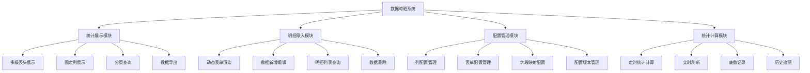
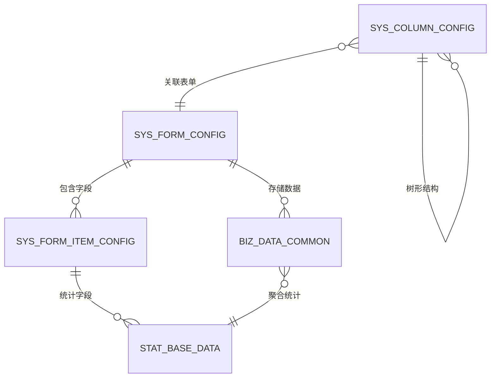
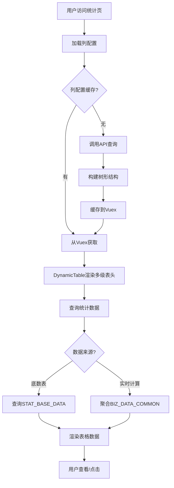
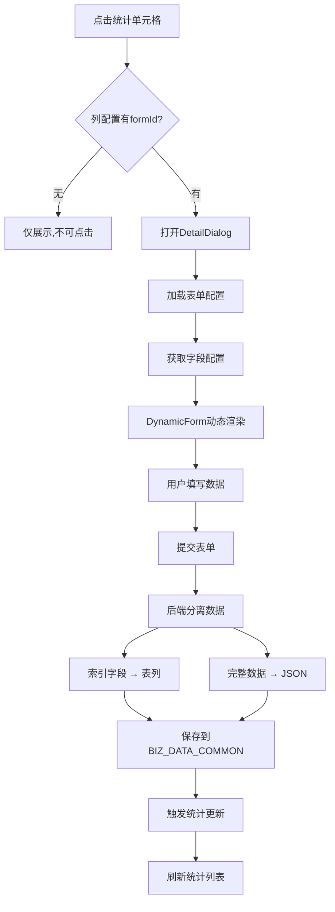
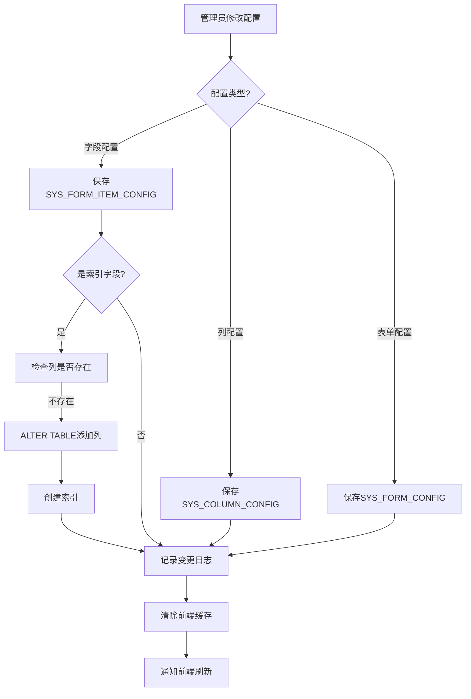
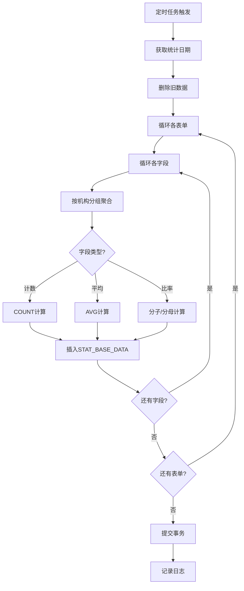
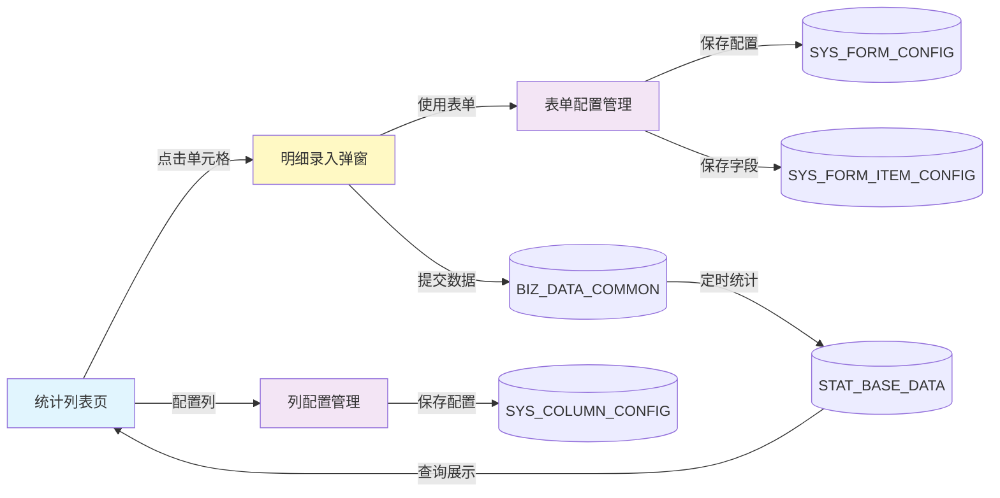

# 数据晾晒统计系统 - 综合开发文档

> **文档版本**: v1.0  
> **创建日期**: 2025-11-26  
> **适用版本**: HDty v2.0.1 + Vue 2.6.14 + Spring Boot 2.x  
> **文档说明**: 本文档整合了数据晾晒功能的需求分析、技术方案、开发计划和流程设计

---

## 📋 目录

- [一、项目概述](#一项目概述)
- [二、核心需求分析](#二核心需求分析)
- [三、技术架构设计](#三技术架构设计)
- [四、数据库设计](#四数据库设计)
- [五、前端开发计划](#五前端开发计划)
- [六、后端开发计划](#六后端开发计划)
- [七、整体流程设计](#七整体流程设计)
- [八、开发排期与里程碑](#八开发排期与里程碑)

---

## 一、项目概述

### 1.1 业务背景

数据晾晒统计系统是为满足多机构、多业务类别的数据统计展示和明细录入需求而设计的高度可配置平台。系统通过配置驱动的方式,实现零代码添加新业务类别,支持动态表单和多级表头展示。

### 1.2 核心价值

| 价值点   | 说明                                   |
| -------- | -------------------------------------- |
| 配置驱动 | 新增业务类别无需修改代码,仅需配置      |
| 灵活扩展 | 支持动态表单、多级表头、字段映射       |
| 高性能   | 定时快照 + 实时刷新策略,支持大数据量   |
| 易维护   | 统一的配置管理,清晰的数据流转,降低成本 |

### 1.3 技术栈

**前端技术栈**:
- Vue 2.6.14
- Webpack 4.46.0
- Element-UI 2.12.0
- HDty 框架自定义组件 (v2.0.1)
- Vuex 3.6.0 + Vue Router 3.0.1

**后端技术栈**:
- Spring Boot 2.x
- MyBatis / MyBatis-Plus
- Oracle 11g+
- Druid 连接池

**开发工具**:
- Node.js 14.21.3
- npm 6.x
- Vue CLI 4.5.15

---

## 二、核心需求分析

### 2.1 功能需求模块



### 2.2 业务功能详解

#### 2.2.1 统计列表展示

**功能描述**: 
- 动态多级表头展示统计数据
- 支持树形结构的列配置(无限层级)
- 固定列: 机构、总数
- 可配置列: 点击弹出明细录入窗口

**数据示例**:
```
┌─────────┬────┬─────────────────────────────────┐
│ 管辖机构 │总数│ 实有人口                         │
│         │    ├────┬────┬────┬──────┬──────┤
│         │    │总数│流动│核查│抽查  │不合格│
├─────────┼────┼────┼────┼────┼──────┼──────┤
│ XX街道   │ 500│ 200│ 80 │95% │ [50] │  5   │
└─────────┴────┴────┴────┴────┴──────┴──────┘
说明: [50] 表示可点击录入明细
```

#### 2.2.2 明细数据录入

**功能描述**:
- 点击统计单元格弹出明细窗口
- 动态表单渲染(根据配置自动生成)
- 支持新增、编辑、删除、查询
- 数据保存后自动更新统计数据

**表单字段类型支持**:
- 基础字段: `input`、`textarea`、`number`、`select`、`radio`、`checkbox`
- HDty组件: `hd-date-picker`、`hd-organ`、`hd-region`、`hd-dict-*`
- 自定义字段: 支持注册自定义字段组件

#### 2.2.3 列配置管理

**功能描述**:
- 树形结构编辑列配置
- 拖拽调整列顺序
- 配置列属性: 标题、宽度、对齐、默认展开
- 关联表单: 配置点击后打开的表单ID
- 样式配置: 条件格式化、点击样式

**配置JSON示例**:
```json
{
  "id": "COL001",
  "label": "实有人口",
  "children": [
    {
      "id": "COL001001",
      "label": "抽查总数",
      "prop": "check_total",
      "formId": "FORM001",
      "columnConfig": {
        "click": {
          "enabled": true,
          "style": {
            "cursor": "pointer",
            "color": "#409EFF"
          }
        },
        "formatter": {
          "type": "number",
          "precision": 0
        }
      }
    }
  ]
}
```

#### 2.2.4 动态表单配置

**功能描述**:
- 表单基础信息配置(名称、编码、数据表)
- 表单项配置(字段类型、验证规则、数据映射)
- 显示控制: 表单显示、列表显示、查询条件
- 字段映射: 索引字段映射到数据库列

**数据映射机制**:
```
核心思想: JSON存储 + 字段映射

完整数据 → DATA_JSON (CLOB)
重要字段 → 映射到表列 (便于查询和索引)

示例:
前端字段名  →  字段配置表  →  数据库列名
checkTime   →  TABLE_KEY   →  DATE_1
checker     →  TABLE_KEY   →  FIELD_1
checkResult →  TABLE_KEY   →  DICT_1
```

### 2.3 非功能需求

| 需求类别   | 具体要求                             |
| ---------- | ------------------------------------ |
| 性能要求   | 列表首屏加载 < 2秒,支持1000+机构数据 |
| 扩展性要求 | 新增业务无需修改代码,支持多级表头    |
| 兼容性要求 | Chrome 80+, Edge 80+, Firefox 75+    |
| 安全性要求 | 数据按机构隔离,防止SQL注入,操作日志  |
| 易用性要求 | 配置界面可视化,支持拖拽,实时预览     |

---

## 三、技术架构设计

### 3.1 整体架构图

```
┌─────────────────────────────────────────────────────────┐
│                  前端层 (Vue2 + HDty)                    │
├─────────────────────────────────────────────────────────┤
│  统计列表页     │  列配置管理    │  表单配置管理        │
│  - StatTable    │  - ColumnTree  │  - FormEditor        │
│  - DetailDialog │  - ColumnEdit  │  - FormItemEditor    │
├─────────────────────────────────────────────────────────┤
│          核心组件(自研)              │  HDty组件(复用)  │
│  - DynamicTable  (动态表格)          │  - hd-date-picker│
│  - DynamicForm   (动态表单)          │  - hd-organ      │
│  - FieldRender   (字段渲染器)        │  - hd-region     │
│                                      │  - hd-dict-*     │
└─────────────────────────────────────────────────────────┘
                         ↕ HTTP/AJAX
┌─────────────────────────────────────────────────────────┐
│              后端层 (Spring Boot + MyBatis)              │
├─────────────────────────────────────────────────────────┤
│  Controller层                                            │
│  - ColumnController  - FormController                   │
│  - DataController    - StatController                   │
├─────────────────────────────────────────────────────────┤
│  Service层                                               │
│  - ColumnService  - FormService                         │
│  - DataService    - StatService                         │
│  核心能力:                                               │
│    • 动态SQL构建  • 字段映射转换  • 统计数据计算       │
├─────────────────────────────────────────────────────────┤
│  Mapper层 (MyBatis)                                      │
│  - ColumnMapper  - FormMapper                           │
│  - DataMapper    - StatMapper                           │
└─────────────────────────────────────────────────────────┘
                         ↕ JDBC
┌─────────────────────────────────────────────────────────┐
│                 数据层 (Oracle)                          │
├─────────────────────────────────────────────────────────┤
│  配置表                │  业务数据表    │  统计表        │
│  - SYS_COLUMN_CONFIG   │  - BIZ_DATA_   │  - STAT_BASE_ │
│  - SYS_FORM_CONFIG     │    COMMON      │    DATA       │
│  - SYS_FORM_ITEM_      │  (JSON+映射)   │  (按字段维度) │
│    CONFIG              │                │               │
├─────────────────────────────────────────────────────────┤
│  存储过程                                                │
│  - SP_CALC_DAILY_STAT (统计计算)                        │
└─────────────────────────────────────────────────────────┘
```

### 3.2 关键技术决策

#### 3.2.1 前端技术决策

| 决策点       | 方案选择                    | 理由                             |
| ------------ | --------------------------- | -------------------------------- |
| 动态表格实现 | 自研 (基于 Element-UI 封装) | 后期自定义需求多,需要完全控制    |
| 动态表单实现 | 自研 (复用 HDty 字段组件)   | 需要灵活配置,复用 HDty 输入组件  |
| 字典选择     | 使用 `hd-dict-*` 系列组件   | 框架已集成字典管理,支持远程/静态 |
| 状态管理     | Vuex 模块化管理             | 列配置、表单配置需要缓存         |
| 数据请求     | 使用 axios-init             | 框架已封装,自动添加 token        |

#### 3.2.2 后端技术决策

| 决策点   | 方案选择                | 理由                       |
| -------- | ----------------------- | -------------------------- |
| 数据存储 | JSON + 映射字段混合存储 | 兼顾灵活性和查询性能       |
| 动态 SQL | MyBatis 动态 SQL        | 支持灵活查询,防止 SQL 注入 |
| 统计计算 | 定时快照 + 实时刷新     | 性能最优,支持历史追溯      |
| 字段映射 | 反射 + 工具类           | 自动映射前端字段到数据库列 |

### 3.3 数据流转设计

#### 3.3.1 配置数据流转

```
管理员配置
    ↓
SYS_COLUMN_CONFIG (列配置表)
    ↓
前端缓存 (Vuex)
    ↓
DynamicTable 组件 (递归渲染多级表头)
```

#### 3.3.2 业务数据流转

```
用户录入
    ↓
DynamicForm 组件 (formData)
    ↓
后端 DataService (分离索引/非索引字段)
    ↓
    ├─ JSON字段  →  DATA_JSON (CLOB)
    ├─ 映射列    →  DATE_1, FIELD_1, DICT_1
    └─ 系统字段  →  ORG_ID, FORM_ID
    ↓
BIZ_DATA_COMMON 表
```

#### 3.3.3 统计数据流转

```
BIZ_DATA_COMMON (明细数据)
    ↓ (定时任务/手动触发)
SP_CALC_DAILY_STAT (存储过程)
    ↓
STAT_BASE_DATA (按字段维度存储)
    ↓
前端统计列表 (多级表头展示)
```

---

## 四、数据库设计

### 4.1 核心表结构

#### 4.1.1 列配置表 (SYS_COLUMN_CONFIG)

**功能**: 存储统计列表的列配置信息,支持树形结构

**关键字段**:
```sql
ID                VARCHAR2(32) PRIMARY KEY,    -- 主键ID
PARENT_ID         VARCHAR2(32),                -- 父节点ID
LABEL             VARCHAR2(100),               -- 列显示名称
PROP              VARCHAR2(100),               -- 属性名名
FORM_ID           VARCHAR2(32),                -- 关联表单ID
DEFAULT_EXPAND    VARCHAR2(10),                -- 默认展开状态
COLUMN_CONFIG     CLOB,                        -- 列前端配置JSON
SORT_NUM          NUMBER(10),                  -- 排序号
```

**COLUMN_CONFIG JSON 配置**:
```json
{
  "style": {"color": "#333"},                    // 样式配置
  "formatter": {"type": "number", "precision": 2}, // 数据格式化
  "conditional": {                                 // 条件显示
    "rules": [
      {"condition": "value > 90", "style": {"color": "#67C23A"}}
    ]
  },
  "click": {                                      // 点击事件
    "enabled": true,
    "style": {"cursor": "pointer", "color": "#409EFF"}
  }
}
```

#### 4.1.2 表单配置表 (SYS_FORM_CONFIG)

**功能**: 存储动态表单的基础信息

**关键字段**:
```sql
ID                VARCHAR2(32) PRIMARY KEY,    -- 主键ID
FORM_CODE         VARCHAR2(100) UNIQUE,        -- 表单编码
FORM_NAME         VARCHAR2(200),               -- 表单名称
DATA_TABLE        VARCHAR2(100),               -- 数据存储表名
FORM_CONFIG       CLOB,                        -- 表单配置JSON
```

#### 4.1.3 表单项配置表 (SYS_FORM_ITEM_CONFIG)

**功能**: 存储表单组件的详细配置信息

**关键字段**:
```sql
ID                VARCHAR2(32) PRIMARY KEY,    -- 组件ID
FORM_ID           VARCHAR2(32),                -- 表单ID
ITEM_TYPE         VARCHAR2(20),                -- 组件类型
ITEM_LABEL        VARCHAR2(200),               -- 组件标签
ITEM_PROP         VARCHAR2(200),               -- 绑定属性名
ITEM_ORDER        NUMBER(10),                  -- 组件排序

-- 显示控制(提取为独立字段)
SHOW_IN_FORM      VARCHAR2(1),                 -- 是否在表单显示
SHOW_IN_LIST      VARCHAR2(1),                 -- 是否在列表显示
SHOW_IN_QUERY     VARCHAR2(1),                 -- 是否作为查询条件
IS_REQUIRED       VARCHAR2(1),                 -- 是否必填

-- 数据映射(提取为独立字段)
IS_FIXED          VARCHAR2(1),                 -- 是否映射到表列
TABLE_KEY         VARCHAR2(100),               -- 数据库列名
KEY_TYPE          VARCHAR2(10),                -- 列类型
DATA_TYPE         VARCHAR2(20),                -- 数据类型
DIC_TYPE          VARCHAR2(100),               -- 字典类型编码

-- 组件配置(JSON,仅含组件特有配置)
ITEM_CONFIG       CLOB,                        -- 组件配置JSON
```

**ITEM_CONFIG JSON 配置** (精简版):
```json
{
  "defaultValue": "",
  "placeholder": "请选择抽查时间",
  "rules": {
    "message": "抽查时间不能为空",
    "trigger": "blur",
    "maxLength": 100
  },
  "componentProps": {
    "type": "date",
    "format": "yyyy-MM-dd",
    "clearable": true
  },
  "layout": {
    "span": 12,
    "labelWidth": "120px"
  }
}
```

#### 4.1.4 通用业务数据表 (BIZ_DATA_COMMON)

**功能**: 采用"JSON存储+预留字段映射"的方式存储业务数据

**关键字段**:
```sql
ID                VARCHAR2(32) PRIMARY KEY,    -- 主键ID
FORM_ID           VARCHAR2(32),                -- 表单ID
DATA_JSON         CLOB,                        -- 完整数据JSON

-- 预留字段(支持动态映射)
FIELD_1 ~ FIELD_20   VARCHAR2,                 -- 预留字符串字段
ORG_ID               VARCHAR2(32),             -- 机构ID
REGION_ID            VARCHAR2(20),             -- 行政区划ID
DICT_1 ~ DICT_10     VARCHAR2(50),             -- 字典字段
NUM_1 ~ NUM_5        NUMBER(20,2),             -- 数字字段
DATE_1 ~ DATE_5      DATE,                     -- 日期字段
```

**数据示例**:
```sql
INSERT INTO BIZ_DATA_COMMON (
    ID, FORM_ID, ORG_ID, DATA_JSON, 
    DATE_1, FIELD_1, DICT_1
) VALUES (
    'DATA001', 'FORM001', 'ORG001',
    '{"checkTime":"2025-11-25","checker":"张三","checkResult":"合格","remark":"无异常"}',
    TO_DATE('2025-11-25', 'YYYY-MM-DD'), '张三', '1'
);
```

#### 4.1.5 统计底数表 (STAT_BASE_DATA)

**功能**: 按字段维度记录统计底数,支持多种值类型

**设计思想**: 
传统设计按机构维度一行存储所有指标,不灵活。新设计按字段维度,每个指标一行,支持扩展。

**关键字段**:
```sql
ID                VARCHAR2(32) PRIMARY KEY,    -- 主键ID
FORM_ID           VARCHAR2(32),                -- 表单ID
FORM_ITEM_ID      VARCHAR2(32),                -- 表单项ID(字段ID)
STAT_DATE         VARCHAR2(8),                 -- 统计日期(YYYYMMDD)
ORG_ID            VARCHAR2(12),                -- 机构ID

-- 值类型及数据
VALUE_TYPE        VARCHAR2(20),                -- 值类型: count/avg/rate/sum
VALUE_1           NUMBER(20,4),                -- 主值
VALUE_2           NUMBER(20,4),                -- 辅助值1(如比率分子)
VALUE_3           NUMBER(20,4),                -- 辅助值2(如比率分母)

DATA_SOURCE       VARCHAR2(20),                -- 数据来源: AUTO/MANUAL
STAT_PERIOD       VARCHAR2(10),                -- 统计周期: day/week/month
```

**VALUE_TYPE 说明**:

| 类型  | VALUE_1含义 | VALUE_2含义 | VALUE_3含义 | 示例                   |
| ----- | ----------- | ----------- | ----------- | ---------------------- |
| count | 计数结果    | -           | -           | 总数:500               |
| avg   | 平均值      | -           | -           | 平均耗时:2.5小时       |
| rate  | 比率结果(%) | 分子        | 分母        | 核查率:95.5% (477/500) |
| sum   | 求和结果    | -           | -           | 总金额:100000          |

### 4.2 数据库关系图



---

## 五、前端开发计划

### 5.1 目录结构规划

```
src/views/business/flex-view/          # 数据晾晒模块根目录
│
├── stat/                              # 统计展示模块
│   ├── index.vue                      # 统计列表主页
│   └── components/
│       ├── StatTable.vue              # 统计表格
│       ├── DetailDialog.vue           # 明细弹窗
│       └── StatQuery.vue              # 查询组件
│
├── config/                            # 配置管理模块
│   ├── column/                        # 列配置管理
│   │   ├── index.vue
│   │   └── components/
│   │       ├── ColumnTree.vue         # 列树形编辑器
│   │       └── ColumnEditor.vue       # 列属性编辑器
│   │
│   └── form/                          # 表单配置管理
│       ├── index.vue
│       ├── form-edit.vue
│       └── components/
│           ├── FormItemList.vue       # 表单项列表
│           └── FormItemEditor.vue     # 表单项编辑器
│
├── components/                        # 组件目录
│   └── common/
│       ├── DynamicTable/              # 动态表格(自研)
│       │   ├── index.vue
│       │   ├── ColumnRender.vue       # 列递归渲染器
│       │   └── CellRender.vue         # 单元格渲染器
│       │
│       └── DynamicForm/               # 动态表单(自研)
│           ├── index.vue
│           ├── FormItem.vue
│           └── FieldRender.vue        # 字段渲染器(复用HDty组件)
│
├── api/                               # API接口
│   ├── column.js
│   ├── form.js
│   ├── form-item.js
│   ├── stat-data.js
│   └── biz-data.js
│
├── store/                             # Vuex状态管理
│   ├── column.js
│   ├── form.js
│   └── stat.js
│
└── utils/                             # 工具函数
    ├── column-tree.js
    ├── form-render.js
    └── stat-calc.js
```

### 5.2 核心组件开发任务

#### 5.2.1 动态表格组件 (DynamicTable)

**任务编号**: FE-01  
**优先级**: 🔴 高  
**工作量**: 2.5天

**功能要求**:
1. ✅ 基于 Element-UI 的 `el-table` 封装
2. ✅ 递归渲染多级表头(无层级限制)
3. ✅ 支持列展开/收起控制
4. ✅ 支持单元格自定义渲染(样式、格式化)
5. ✅ 支持单元格点击事件
6. ✅ 支持列配置的热更新

**技术方案**:
```vue
<template>
  <el-table :data="data" border>
    <column-render
      v-for="col in columns"
      :key="col.id"
      :column="col"
      @cell-click="handleCellClick"
    />
  </el-table>
</template>

<script>
import ColumnRender from './ColumnRender.vue'

export default {
  name: 'DynamicTable',
  components: { ColumnRender },
  props: {
    columns: Array,
    data: Array
  }
}
</script>
```

**列递归渲染器 (ColumnRender.vue)**:
```vue
<el-table-column :label="column.label" :width="column.width">
  <!-- 有子列,递归渲染 -->
  <column-render
    v-for="child in column.children"
    :key="child.id"
    :column="child"
  />
  
  <!-- 叶子节点,渲染数据 -->
  <template v-else slot-scope="scope">
    <cell-render
      :value="scope.row[column.prop]"
      :column="column"
      @click="$emit('cell-click', { column, row: scope.row })"
    />
  </template>
</el-table-column>
```

#### 5.2.2 动态表单组件 (DynamicForm)

**任务编号**: FE-02  
**优先级**: 🔴 高  
**工作量**: 2.5天

**功能要求**:
1. ✅ 基于 Element-UI 的 `el-form` 封装
2. ✅ **复用 HDty 字段组件**: `hd-date-picker`、`hd-organ`、`hd-region`、`hd-dict-*`
3. ✅ 支持字段类型扩展(可插拔式)
4. ✅ 支持复杂布局(行列布局、分组)
5. ✅ 支持字段联动(显示/隐藏、必填、禁用)
6. ✅ 支持自定义验证规则

**技术方案**:
```vue
<template>
  <el-form ref="formRef" :model="formData" :rules="formRules">
    <el-row :gutter="20">
      <el-col
        v-for="item in formItems"
        :key="item.id"
        :span="getItemSpan(item)"
      >
        <el-form-item :label="item.itemLabel" :prop="item.itemProp">
          <!-- 动态渲染字段 -->
          <field-render
            :item="item"
            :value="formData[item.itemProp]"
            @input="handleInput(item.itemProp, $event)"
          />
        </el-form-item>
      </el-col>
    </el-row>
  </el-form>
</template>
```

**字段渲染器 (FieldRender.vue)** - 复用 HDty 组件:
```vue
<component
  :is="getFieldComponent(item.itemType)"
  :value="value"
  v-bind="getComponentProps(item)"
  @input="$emit('input', $event)"
/>

<script>
export default {
  methods: {
    getFieldComponent(type) {
      const map = {
        'input': 'el-input',
        'select': 'el-select',
        'date': 'hd-date-picker',      // HDty组件
        'organ': 'hd-organ',            // HDty组件
        'region': 'hd-region',          // HDty组件
        'dict-select': 'hd-dict-select' // HDty组件
      }
      return map[type] || 'el-input'
    }
  }
}
</script>
```

### 5.3 前端开发任务清单

| 任务编号 | 任务名称              | 优先级 | 工作量 | 依赖     | 状态     |
| -------- | --------------------- | ------ | ------ | -------- | -------- |
| FE-01    | DynamicTable 组件开发 | 🔴 高   | 2.5天  | -        | ⏳ 待开始 |
| FE-02    | DynamicForm 组件开发  | 🔴 高   | 2.5天  | -        | ⏳ 待开始 |
| FE-03    | API 接口封装          | 🔴 高   | 1天    | -        | ⏳ 待开始 |
| FE-04    | Vuex 状态管理         | 🔴 高   | 1天    | FE-03    | ⏳ 待开始 |
| FE-05    | 统计列表页面          | 🔴 高   | 2.5天  | FE-01,04 | ⏳ 待开始 |
| FE-06    | 列配置管理页面        | 🟡 中   | 2天    | FE-01    | ⏳ 待开始 |
| FE-07    | 表单配置管理页面      | 🟡 中   | 2天    | FE-02    | ⏳ 待开始 |
| FE-08    | 路由配置              | 🟡 中   | 0.5天  | -        | ⏳ 待开始 |
| FE-09    | 联调测试              | 🔴 高   | 2天    | ALL      | ⏳ 待开始 |

**总计**: 约 16.5 天

---

## 六、后端开发计划

### 6.1 目录结构规划

```
hdty-data-backend/
├─ src/main/java/com/hdty/data/
│  ├─ controller/
│  │  ├─ ColumnController.java      # 列配置接口
│  │  ├─ FormController.java        # 表单配置接口
│  │  ├─ DataController.java        # 业务数据接口
│  │  └─ StatController.java        # 统计接口
│  ├─ service/
│  │  └─ impl/
│  │     ├─ ColumnServiceImpl.java
│  │     ├─ FormServiceImpl.java
│  │     ├─ DataServiceImpl.java    # 核心:动态SQL
│  │     └─ StatServiceImpl.java
│  ├─ mapper/
│  ├─ entity/
│  ├─ dto/
│  ├─ vo/
│  └─ util/
│     ├─ TreeUtil.java              # 树形数据工具
│     ├─ FieldMapUtil.java          # 字段映射工具
│     └─ SqlUtil.java               # 动态SQL工具
└─ src/main/resources/mapper/
```

### 6.2 核心功能实现

#### 6.2.1 动态SQL构建

**任务编号**: BE-01  
**优先级**: 🔴 高  
**工作量**: 2天

**功能要求**:
1. 支持任意字段查询
2. 支持动态添加字段后的查询
3. 防止SQL注入
4. 性能可接受

**技术方案 (MyBatis 动态SQL)**:
```xml
<!-- mapper/DataMapper.xml -->
<select id="selectByDynamicCondition" parameterType="map" 
        resultType="BizDataCommon">
  SELECT * FROM BIZ_DATA_COMMON
  WHERE FORM_ID = #{formId}
  AND STATUS = '1'
  
  <!-- 动态索引字段条件 -->
  <if test="indexConditions != null">
    <foreach collection="indexConditions" index="key" item="value">
      <if test="value != null">
        AND ${key} = #{value}
      </if>
    </foreach>
  </if>
</select>
```

#### 6.2.2 字段映射工具

**任务编号**: BE-02  
**优先级**: 🔴 高  
**工作量**: 1.5天

**功能要求**:
1. 前端字段名 → 数据库列名 自动映射
2. 支持类型转换(String → Date, Number等)
3. 反射设置字段值

**技术方案**:
```java
// util/FieldMapUtil.java
public class FieldMapUtil {
    
    /**
     * 设置字段值(通过反射)
     */
    public static void setFieldValue(Object entity, String dbColumn, Object value) 
        throws Exception {
        // 转换列名为字段名: CHECK_TIME → checkTime
        String fieldName = toCamelCase(dbColumn);
        
        Field field = entity.getClass().getDeclaredField(fieldName);
        field.setAccessible(true);
        
        // 类型转换
        Object convertedValue = convertValue(value, field.getType());
        field.set(entity, convertedValue);
    }
    
    /**
     * 获取字段值(通过反射)
     */
    public static Object getFieldValue(Object entity, String dbColumn) 
        throws Exception {
        String fieldName = toCamelCase(dbColumn);
        Field field = entity.getClass().getDeclaredField(fieldName);
        field.setAccessible(true);
        return field.get(entity);
    }
}
```

#### 6.2.3 统计计算存储过程

**任务编号**: BE-03  
**优先级**: 🔴 高  
**工作量**: 2天

**功能要求**:
1. 定时任务调用,生成每日统计底数
2. 支持增量更新
3. 支持手动刷新

**技术方案**:
```sql
CREATE OR REPLACE PROCEDURE SP_CALC_DAILY_STAT(
    P_STAT_DATE IN DATE,
    P_ORG_ID    IN VARCHAR2,
    P_RESULT    OUT VARCHAR2
) AS
BEGIN
    -- 删除当日旧数据
    DELETE FROM STAT_BASE_DATA 
    WHERE STAT_DATE = TO_CHAR(P_STAT_DATE, 'YYYYMMDD')
    AND (P_ORG_ID IS NULL OR ORG_ID = P_ORG_ID);
    
    -- 循环各表单,计算统计数据
    FOR form_rec IN (
        SELECT ID, FORM_CODE FROM SYS_FORM_CONFIG WHERE STATUS = '1'
    ) LOOP
        -- 循环各字段,计算统计值
        FOR item_rec IN (
            SELECT * FROM SYS_FORM_ITEM_CONFIG 
            WHERE FORM_ID = form_rec.ID AND IS_FIXED = '1'
        ) LOOP
            -- 根据字段类型计算不同统计值
            -- ...
        END LOOP;
    END LOOP;
    
    COMMIT;
    P_RESULT := 'SUCCESS';
    
EXCEPTION
    WHEN OTHERS THEN
        ROLLBACK;
        P_RESULT := 'ERROR:' || SQLERRM;
END;
```

### 6.3 后端开发任务清单

| 任务编号 | 任务名称           | 优先级 | 工作量 | 依赖  | 状态     |
| -------- | ------------------ | ------ | ------ | ----- | -------- |
| BE-01    | 数据库设计与初始化 | 🔴 高   | 2天    | -     | ⏳ 待开始 |
| BE-02    | 动态SQL构建        | 🔴 高   | 2天    | BE-01 | ⏳ 待开始 |
| BE-03    | 字段映射工具       | 🔴 高   | 1.5天  | -     | ⏳ 待开始 |
| BE-04    | 配置管理API        | 🔴 高   | 1.5天  | BE-01 | ⏳ 待开始 |
| BE-05    | 业务数据API        | 🔴 高   | 2天    | BE-02 | ⏳ 待开始 |
| BE-06    | 统计数据API        | 🔴 高   | 1天    | BE-01 | ⏳ 待开始 |
| BE-07    | 统计计算逻辑       | 🔴 高   | 2天    | BE-01 | ⏳ 待开始 |
| BE-08    | 单元测试           | 🟡 中   | 1天    | ALL   | ⏳ 待开始 |

**总计**: 约 13 天

---

## 七、整体流程设计

### 7.1 数据统计展示流程



### 7.2 明细数据录入流程



### 7.3 配置变更流程



### 7.4 统计数据生成流程



### 7.5 模块关系图



---

## 八、开发排期与里程碑

### 8.1 整体规划

```
项目总工期: 约 4.5 周 (2人并行开发)

┌─────────────────────────────────────────────────────────┐
│  第1周: 基础设施搭建 + 技术预研                          │
├─────────────────────────────────────────────────────────┤
│  - 数据库设计与初始化 (2天)                              │
│  - 后端 API 框架搭建 (2天)                               │
│  - 前端基础设施搭建 (API 封装、Vuex) (2天)              │
│  - 核心组件技术方案设计 (1天)                            │
└─────────────────────────────────────────────────────────┘
                         ↓
┌─────────────────────────────────────────────────────────┐
│  第2周: 核心功能开发                                     │
├─────────────────────────────────────────────────────────┤
│  - 后端核心 API 开发 (配置管理、数据录入) (3天)         │
│  - 前端核心组件开发 (DynamicTable、DynamicForm) (5天)   │
└─────────────────────────────────────────────────────────┘
                         ↓
┌─────────────────────────────────────────────────────────┐
│  第3周: 页面开发 + 统计计算                              │
├─────────────────────────────────────────────────────────┤
│  - 后端统计计算逻辑 (定时任务、存储过程) (2天)          │
│  - 前端统计列表页面开发 (2.5天)                          │
│  - 前端配置管理页面开发 (3.5天)                          │
└─────────────────────────────────────────────────────────┘
                         ↓
┌─────────────────────────────────────────────────────────┐
│  第4周: 联调测试 + 优化                                  │
├─────────────────────────────────────────────────────────┤
│  - 前后端联调 (2天)                                      │
│  - 单元测试编写 (1天)                                    │
│  - 集成测试与 Bug 修复 (2天)                            │
│  - 性能优化(大数据量测试) (1天)                         │
└─────────────────────────────────────────────────────────┘
                         ↓
┌─────────────────────────────────────────────────────────┐
│  第5周: 文档完善 + 交付                                  │
├─────────────────────────────────────────────────────────┤
│  - 文档完善 (1天)                                        │
│  - 部署上线 (1天)                                        │
│  - 培训与交付 (1天)                                      │
└─────────────────────────────────────────────────────────┘
```

### 8.2 里程碑

| 里程碑               | 时间节点 | 交付内容                     | 验收标准                 |
| -------------------- | -------- | ---------------------------- | ------------------------ |
| **M1: 基础搭建完成** | 第1周末  | 数据库、后端框架、前端基础   | API 可调通,前端可访问    |
| **M2: 核心功能完成** | 第2周末  | 核心组件、基础API            | 组件可正常渲染,API可调用 |
| **M3: 页面开发完成** | 第3周末  | 统计列表、配置管理、统计计算 | 页面可访问,配置可保存    |
| **M4: 联调测试完成** | 第4周末  | 完整功能、测试通过           | 功能正常,无严重Bug       |
| **M5: 项目交付**     | 第5周末  | 完整系统、文档、部署         | 通过验收测试,可上线使用  |

### 8.3 风险评估与应对

| 风险项           | 风险等级 | 风险描述                | 应对方案                      |
| ---------------- | -------- | ----------------------- | ----------------------------- |
| 动态表格开发难度 | ⚠️ 中     | 多级表头递归渲染复杂    | 参考成熟方案,迭代优化         |
| 动态表单开发难度 | ⚠️ 中     | 字段类型多,联动逻辑复杂 | 先实现基础功能,后续迭代增强   |
| 大数据量统计性能 | ⚠️ 中     | 100万+数据统计可能较慢  | 分区表 + 增量更新 + 缓存      |
| 前后端联调风险   | ⚠️ 低     | 接口对接可能有偏差      | 提前确定接口规范,使用Mock数据 |
| 需求变更风险     | ⚠️ 低     | 开发过程中需求可能调整  | 采用敏捷开发,每周评审         |

### 8.4 人员分工

**前端开发人员** (1人):
- 核心组件开发 (DynamicTable、DynamicForm)
- 统计列表页面开发
- 配置管理页面开发
- 前端联调测试

**后端开发人员** (1人):
- 数据库设计与初始化
- 后端 API 开发
- 统计计算逻辑
- 后端联调测试

**并行开发**:
- 第1周: 并行进行数据库设计和前端基础搭建
- 第2周: 并行进行后端API和前端组件开发
- 第3周: 并行进行统计计算和页面开发
- 第4周: 协作联调测试

---

## 附录

### 附录A: 关键文档清单

| 文档名称         | 路径                                         | 说明             |
| ---------------- | -------------------------------------------- | ---------------- |
| 需求规格说明书   | `/dev-md/需求规格说明书.md`                  | 详细的业务需求   |
| 系统架构设计文档 | `/dev-md/系统架构设计文档.md`                | 技术架构设计     |
| 数据库设计文档   | `/dev-md/数据库设计文档.md`                  | 数据库表结构设计 |
| 前端开发文档     | `/dev-md/前端开发文档.md`                    | 前端开发指南     |
| 后端开发文档     | `/dev-md/后端开发文档.md`                    | 后端开发指南     |
| 前端开发计划     | `/project-docs/02-前端开发计划.md`           | 前端任务拆分     |
| HDty组件使用规范 | `/project-docs/05-HDty组件使用规范与模板.md` | 组件使用参考     |
| 项目目录结构树   | `/project-docs/06-项目目录结构树.md`         | 项目目录说明     |

### 附录B: 常用命令

```bash
# 前端开发
npm install              # 安装依赖
npm run dev              # 启动开发服务器(端口8060)
npm run build            # 生产构建
npm run lint             # 代码检查

# 后端开发
mvn clean package        # 打包
mvn clean install        # 安装到本地仓库
mvn spring-boot:run      # 运行Spring Boot应用
```

### 附录C: 技术支持

- **HDty框架文档**: `/mdList/` 目录下的工具类说明
- **Element-UI文档**: https://element.eleme.io/2.12/
- **Vue2文档**: https://v2.cn.vuejs.org/
- **MyBatis文档**: https://mybatis.org/mybatis-3/zh/index.html

---

**文档维护**: 项目组全体成员  
**最后更新**: 2025-11-26  
**下次评审**: 开发启动时
