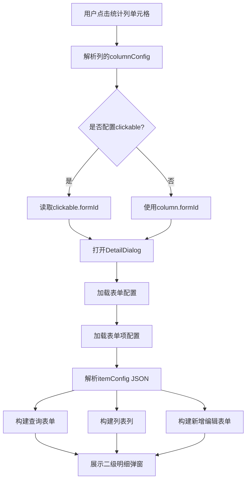
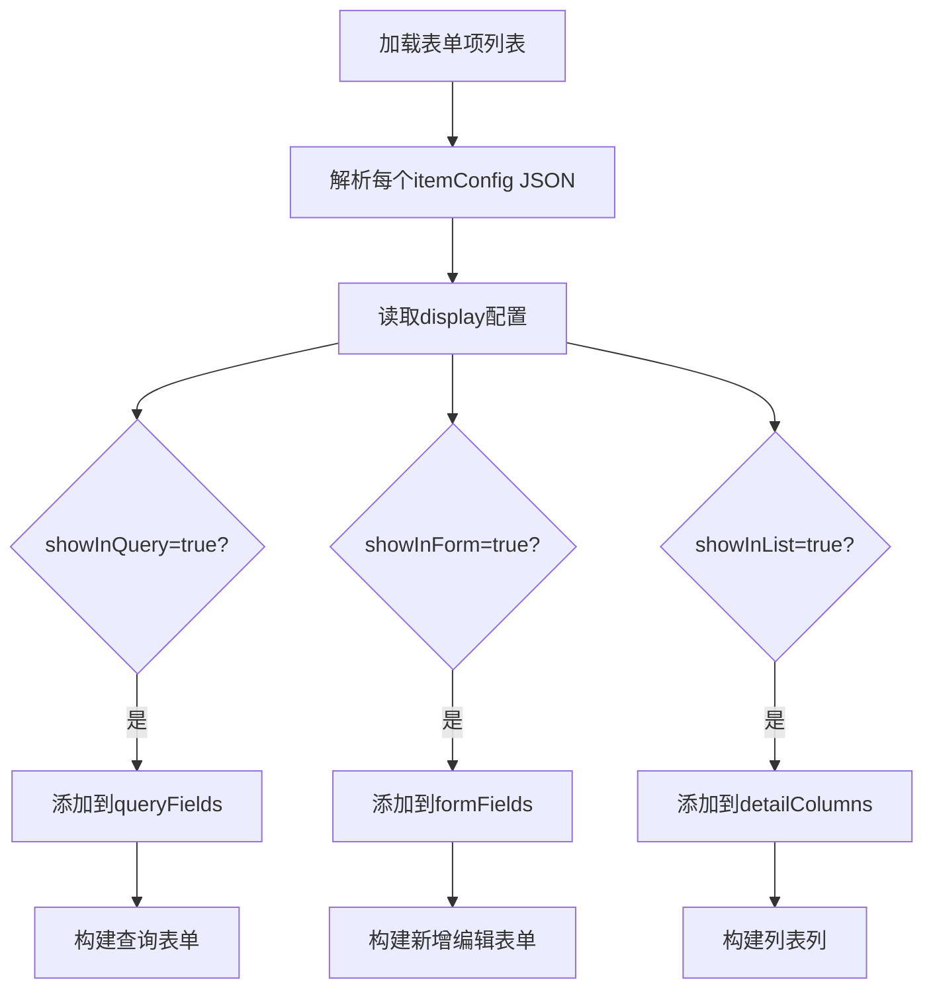

# 动态统计列表与二级明细实现说明

## 一、功能概述

本文档说明动态统计列表以及可点击的二级明细动态列表及其动态表单的完整实现方案。

### 1.1 核心功能

1. **动态统计列表**: 根据列配置动态渲染多层级表格
2. **可点击单元格**: 配置了 formId 的列可点击查看明细
3. **二级明细列表**: 弹窗展示明细数据的动态列表
4. **动态表单**: 支持查询、新增、编辑的完全配置化表单
5. **灵活布局**: 通过JSON配置控制表单布局(一行1个或2个字段)

## 二、配置设计

### 2.1 不新增数据库字段原则

所有扩展配置都存储在现有的JSON字段中：
- **列配置**: 使用 `columnConfig` 字段(CLOB)
- **表单项配置**: 使用 `itemConfig` 字段(CLOB)

### 2.2 列配置 JSON 结构

```json
{
  "clickable": {
    "enabled": true,
    "formId": "FORM001",
    "openType": "dialog"
  },
  "style": {
    "color": "#409EFF",
    "cursor": "pointer"
  },
  "conditional": {
    "rules": [
      {
        "condition": "value > 90",
        "style": { "color": "#67C23A" }
      }
    ]
  }
}
```

### 2.3 表单项配置 JSON 结构

```json
{
  "display": {
    "showInForm": true,
    "showInList": true,
    "showInQuery": false,
    "columnWidth": 120
  },
  "layout": {
    "span": 12,
    "labelWidth": "120px"
  },
  "validation": {
    "required": true,
    "message": "不能为空"
  },
  "componentProps": {
    "clearable": true,
    "filterable": true
  }
}
```

## 三、核心组件说明

### 3.1 DetailDialog (二级明细弹窗)

**文件路径**: `src/views/business/flex-view/stat/components/DetailDialog.vue`

**功能**:
- 根据 formId 加载表单配置和表单项配置
- 解析 itemConfig JSON，筛选字段:
  - `showInQuery=true` → 构建查询表单
  - `showInForm=true` → 构建新增/编辑表单
  - `showInList=true` → 构建列表列
- 实现完整的增删改查功能

**关键方法**:

```javascript
// 加载表单配置
async loadFormConfig() {
  const response = await getFormConfig({ id: this.formId });
  this.formConfig = response.data.data.vo;
}

// 加载表单项配置并解析
async loadFormItems() {
  const response = await getFormItemPage({ formId: this.formId });
  const items = response.data.data.records;
  
  // 解析每个表单项的 itemConfig
  const parsedItems = items.map(item => ({
    vo: item.vo,
    config: JSON.parse(item.vo.itemConfig)
  }));
  
  // 根据 display 配置筛选字段
  this.queryFields = parsedItems
    .filter(item => item.config.display?.showInQuery)
    .map(item => this.convertToFormField(item));
    
  this.formFields = parsedItems
    .filter(item => item.config.display?.showInForm !== false)
    .map(item => this.convertToFormField(item));
    
  this.detailColumns = parsedItems
    .filter(item => item.config.display?.showInList)
    .map(item => this.convertToColumn(item));
}

// 转换为表单字段配置
convertToFormField(item) {
  const config = item.config;
  return {
    prop: item.vo.itemProp,
    label: item.vo.itemLabel,
    type: item.vo.itemType,
    span: config.layout?.span || 12, // 一行2个字段
    required: config.validation?.required,
    config: config
  };
}
```

### 3.2 DynamicForm (动态表单组件)

**文件路径**: `src/views/business/flex-view/components/common/DynamicForm/index.vue`

**功能**:
- 根据 formItems 配置动态渲染表单
- 支持 span 控制布局(12=半行, 24=整行)
- 支持三种模式: add/edit/view

**关键方法**:

```javascript
// 获取字段占位
getItemSpan(item) {
  // 优先使用 item.span
  if (item.span !== undefined) {
    return item.span;
  }
  
  // 从 config 中解析
  const config = this.parseConfig(item);
  if (config.span) {
    return config.span;
  }
  
  // 从 layout 中解析
  if (config.layout?.span) {
    return config.layout.span;
  }
  
  // 默认值
  return this.inline ? 8 : 12;
}
```

### 3.3 DynamicColumn (动态列组件)

**文件路径**: `src/views/business/flex-view/stat/components/DynamicColumn.vue`

**功能**:
- 递归渲染多层级列
- 支持点击事件
- 支持条件样式
- 支持数据格式化

**关键方法**:

```javascript
// 解析列配置
parseColumnConfig(column) {
  return typeof column.columnConfig === "string"
    ? JSON.parse(column.columnConfig)
    : column.columnConfig || {};
}

// 获取单元格样式
getCellStyle(column, row) {
  const columnConfig = this.parseColumnConfig(column);
  const style = { ...columnConfig.style };
  
  // 应用条件样式
  if (columnConfig.conditional?.rules) {
    const value = row[column.prop];
    for (const rule of columnConfig.conditional.rules) {
      if (this.evalCondition(rule.condition, value)) {
        Object.assign(style, rule.style);
        break;
      }
    }
  }
  
  return style;
}
```

### 3.4 FieldRender (字段渲染组件)

**文件路径**: `src/views/business/flex-view/components/common/DynamicForm/FieldRender.vue`

**功能**:
- 根据 itemType 渲染对应的组件
- 支持多种 HDty 组件
- 支持自定义配置传递

**支持的组件类型**:
- input, textarea, number
- select, radio, checkbox
- date, datetime, daterange
- dict-select, dict-radio, dict-checkbox
- organ, region

## 四、数据流转流程

### 4.1 统计页面点击流程



### 4.2 表单项配置解析流程



## 五、配置示例

### 5.1 可点击列配置

**列配置表 (SYS_COLUMN_CONFIG)**:

| 字段         | 值           |
| ------------ | ------------ |
| label        | 抽查总数     |
| prop         | check_total  |
| columnWidth  | 100          |
| columnConfig | (见下方JSON) |

**columnConfig JSON**:
```json
{
  "clickable": {
    "enabled": true,
    "formId": "CHECK_FORM_001",
    "openType": "dialog",
    "dialogWidth": "80%"
  },
  "style": {
    "color": "#409EFF",
    "cursor": "pointer",
    "textDecoration": "underline"
  },
  "formatter": {
    "type": "number",
    "precision": 0
  }
}
```

### 5.2 表单项配置示例

#### 示例1: 姓名字段 (一行2个)

**表单项配置表 (SYS_FORM_ITEM_CONFIG)**:

| 字段       | 值           |
| ---------- | ------------ |
| itemType   | input        |
| itemLabel  | 姓名         |
| itemProp   | name         |
| itemConfig | (见下方JSON) |

**itemConfig JSON**:
```json
{
  "placeholder": "请输入姓名",
  "display": {
    "showInForm": true,
    "showInList": true,
    "showInQuery": true,
    "columnWidth": 120
  },
  "layout": {
    "span": 12
  },
  "validation": {
    "required": true,
    "message": "姓名不能为空",
    "maxLength": 50
  },
  "componentProps": {
    "clearable": true,
    "maxlength": 50
  }
}
```

#### 示例2: 备注字段 (独占一行)

```json
{
  "placeholder": "请输入备注信息",
  "display": {
    "showInForm": true,
    "showInList": false,
    "showInQuery": false
  },
  "layout": {
    "span": 24
  },
  "componentProps": {
    "rows": 3,
    "maxlength": 500,
    "showWordLimit": true
  }
}
```

#### 示例3: 字典选择字段

```json
{
  "placeholder": "请选择状态",
  "display": {
    "showInForm": true,
    "showInList": true,
    "showInQuery": true,
    "columnWidth": 100
  },
  "layout": {
    "span": 12
  },
  "validation": {
    "required": true
  },
  "componentProps": {
    "dictCode": "ZXBS",
    "filterable": true
  },
  "listFormatter": {
    "type": "dict",
    "dictCode": "ZXBS"
  }
}
```

## 六、使用指南

### 6.1 配置可点击列

1. 在列配置管理中，找到需要配置的列
2. 编辑 columnConfig 字段，添加 clickable 配置:
```json
{
  "clickable": {
    "enabled": true,
    "formId": "你的表单ID"
  },
  "style": {
    "color": "#409EFF",
    "cursor": "pointer"
  }
}
```

### 6.2 配置表单项布局

1. 在表单项配置管理中，编辑 itemConfig
2. 设置 layout.span:
   - span=12: 一行显示2个字段
   - span=24: 独占一行

### 6.3 配置显示控制

在 itemConfig 的 display 配置中:
```json
{
  "display": {
    "showInForm": true,    // 在表单中显示
    "showInList": true,     // 在列表中显示
    "showInQuery": false,   // 作为查询条件
    "columnWidth": 120      // 列表列宽
  }
}
```

## 七、注意事项

1. **JSON格式**: 所有配置必须是合法的JSON格式
2. **向后兼容**: 未配置的字段使用默认值，不影响旧数据
3. **formId关联**: 确保 clickable.formId 对应的表单已配置
4. **字段映射**: 表单项的 tableKey 要与数据库字段对应
5. **字典编码**: dictCode 要与系统字典类型一致

## 八、常见问题

### Q1: 列点击没反应?
**A**: 检查 columnConfig 中的 clickable.enabled 是否为 true，formId 是否正确

### Q2: 表单字段不显示?
**A**: 检查 itemConfig 中的 display.showInForm 配置

### Q3: 表单布局不对?
**A**: 检查 layout.span 配置，12=半行，24=整行

### Q4: 字典不显示?
**A**: 检查 componentProps.dictCode 是否与系统字典类型一致

### Q5: 列表列不显示?
**A**: 检查 display.showInList 是否为 true

## 九、后续优化方向

1. ✅ 支持条件样式
2. ✅ 支持数据格式化
3. ✅ 支持灵活布局
4. 🔲 支持字段联动
5. 🔲 支持条件显示/隐藏
6. 🔲 支持自定义校验器
7. 🔲 支持批量导入/导出

---

**文档版本**: v1.0  
**最后更新**: 2025-12-02  
**维护人员**: AI助手
