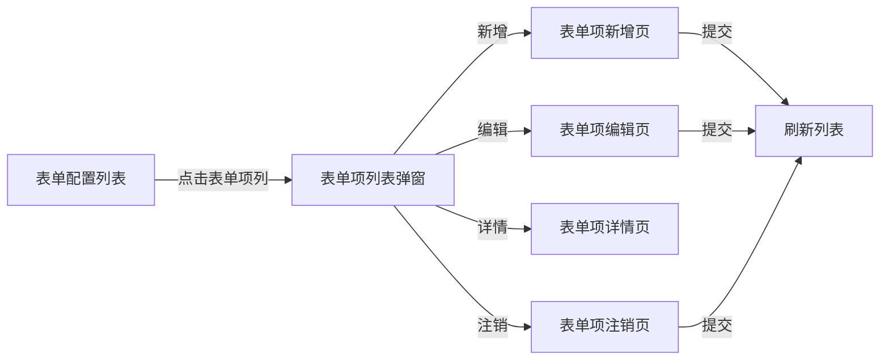

# 表单项配置管理模块

## 📋 模块概述

表单项配置管理模块是表单配置的二级明细模块,用于管理表单中的各个组件配置项。通过点击表单配置列表中的"表单项"列,可以进入该模块进行表单项的增删改查操作。

## 📁 文件结构

```
form-item/
├── api/
│   └── index.js              # API接口定义
├── constants.js              # 常量定义
├── index.vue                 # 表单项列表页(二级明细列表)
├── FormItemAdd.vue           # 新增表单项
├── FormItemEdit.vue          # 编辑表单项
├── FormItemDetail.vue        # 表单项详情
├── FormItemLogout.vue        # 注销表单项
└── README.md                 # 本文档
```

## 🔌 接口路径

所有接口的基础路径为: `/web/sjls/sysFormItemConfig/`

- `page` - 分页查询
- `add` - 新增
- `edit` - 编辑
- `editBefore` - 编辑前查询
- `detail` - 详情查询
- `logout` - 注销
- `singleDelete` - 删除
- `updateStatus` - 更新状态
- `exports` - 导出

## 💾 数据表结构

对应数据库表: `SYS_FORM_ITEM_CONFIG`

### 主要字段说明

#### 基本信息
- `ID` - 组件ID(主键)
- `FORM_ID` - 表单ID(外键,关联SYS_FORM_CONFIG)
- `ITEM_TYPE` - 组件类型(input/select/date/textarea等)
- `ITEM_LABEL` - 组件标签(显示名称)
- `ITEM_PROP` - 组件绑定属性名
- `ITEM_ORDER` - 组件排序号

#### 显示控制
- `SHOW_IN_FORM` - 是否在表单中显示(1-是, 0-否)
- `SHOW_IN_LIST` - 是否在列表中显示(1-是, 0-否)
- `SHOW_IN_QUERY` - 是否作为查询条件(1-是, 0-否)
- `COLUMN_WIDTH` - 列表列宽
- `IS_DISABLED` - 是否禁用(1-是, 0-否)
- `IS_READONLY` - 是否只读(1-是, 0-否)
- `IS_REQUIRED` - 是否必填(1-是, 0-否)

#### 数据映射
- `IS_FIXED` - 是否为固定项(映射到表列, 1-是, 0-否)
- `TABLE_KEY` - 固定属性对应的数据库列名(如:FIELD_1/ORG_ID/DICT_1等)
- `KEY_TYPE` - 列类型(field/org/region/dict/num/date)
- `DATA_TYPE` - 数据类型(VARCHAR2/NUMBER/DATE/CLOB)
- `DIC_TYPE` - 字典类型编码(KEY_TYPE=dict时使用)

#### 组件配置
- `ITEM_CONFIG` - 组件配置JSON(存储组件特有的渲染配置)

## 🎯 功能特性

### 1. 列表功能
- 支持按组件标签、属性名、组件类型等条件查询
- 支持注销状态筛选
- 点击组件标签可查看详情
- 下拉操作菜单(详情、编辑、注销)

### 2. 新增/编辑功能
采用左侧锚点导航布局,分为4个区块:

#### 基本信息
- 组件类型选择
- 组件标签
- 属性名
- 组件排序

#### 显示控制
- 表单显示、列表显示、查询显示开关
- 是否必填、是否禁用、是否只读
- 列表列宽设置

#### 数据映射
- 是否固定项(是否映射到数据库预留字段)
- 列类型选择(普通字段/机构/区划/字典/数字/日期)
- 数据类型选择
- 映射列名(如FIELD_1、ORG_ID、DICT_1等)
- 字典类型编码(仅字典类型时需要)

#### 组件配置
- 使用hd-json-editor组件编辑组件配置JSON
- 备注信息

### 3. 详情功能
- 采用与新增/编辑相同的锚点导航布局
- 新增"操作信息"区块,显示创建、更新、注销信息
- 组件配置JSON格式化显示

### 4. 注销功能
- 参考@FormManageList.vue中的注销表单样式
- 简洁的注销原因录入表单

## 🔗 使用方式

### 在表单列表中打开

表单配置列表页(`form/index.vue`)中新增了"表单项"列,显示该表单的表单项数量,点击数字即可打开表单项管理弹窗。

```javascript
// 点击表单项列
handleFormItem(row) {
  this.$refs.itemListRef.visible = true;
  this.$refs.itemListRef.row = row;
  this.$nextTick(() => {
    this.$refs.itemListRef.queryData.zxbs = this.queryData.zxbs;
    this.$refs.itemListRef.loadList();
  });
}
```

## 📊 数据流程



## 🎨 样式规范

1. **列表样式**
   - 表格序号列固定宽度60px
   - 可点击链接使用蓝色下划线样式
   - 操作列使用下拉菜单风格

2. **表单样式**
   - 采用左侧锚点导航布局
   - 使用biz-form-card组件分区块
   - 每个字段独立占行或按需分栏

3. **标签显示**
   - 组件类型使用蓝色primary标签
   - 是否固定使用绿色success/灰色info标签
   - 注销状态使用色彩区分(有效/注销)

## ⚠️ 注意事项

1. **数据映射逻辑**
   - 当`IS_FIXED=1`时,必须填写`TABLE_KEY`、`KEY_TYPE`、`DATA_TYPE`
   - 当`KEY_TYPE=dict`时,必须填写`DIC_TYPE`
   - 当`IS_FIXED=0`时,相关映射字段自动清空且禁用

2. **组件配置JSON格式**
   - 使用hd-json-editor组件,支持JSON格式校验
   - 详情页中JSON自动格式化显示

3. **父子关系**
   - 表单项必须关联到某个表单(`FORM_ID`)
   - 列表页标题显示父级表单名称

## 🔄 更新记录

- 2024-12-01: 初始创建,实现表单项配置的完整增删改查功能

---

**开发建议**: 后续如需扩展,可参考此模块结构,保持一致的代码风格和交互体验。
